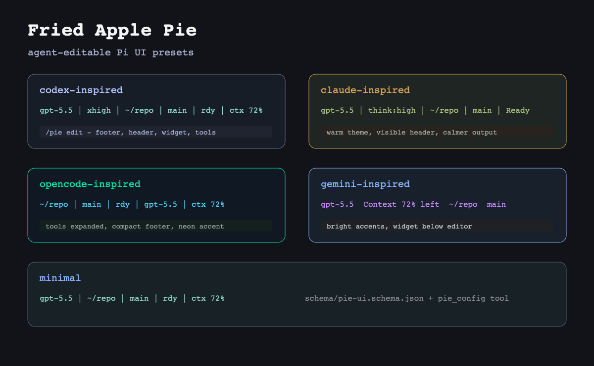

# Fried Apple Pie

Agent-editable Pi UI presets, themes, and config.

<div align="center">
  
</div>

## Install

```sh
pi install .
```

After npm publish:

```sh
pi install npm:fried-apple-pie
```

For one local run:

```sh
pi -e .
```

## Presets

Cross-agent inspired (layout + theme):

- `minimal`
- `claude-inspired`
- `opencode-inspired`
- `codex-inspired`
- `gemini-inspired`
- `aider-inspired`
- `copilot-inspired`

Theme-only (minimal layout, popular color schemes):

- `dracula`
- `tokyo-night`
- `catppuccin-mocha`
- `nord`
- `gruvbox-dark`

These are inspired presets, not exact clones.

## Commands

```txt
/pie
/pie preset minimal
/pie preset codex-inspired clean
/pie preset codex-inspired merge
/pie mode theme-only
/pie persona startrek
/pie gallery
/pie edit
/pie welcome
/pie export
/pie preset claude-inspired
/pie show
/pie doctor
/pie doctor strict
/pie reset
```

## Personas

Persona is an orthogonal axis to preset. It controls the working spinner and verb pack without touching layout or theme.

- `default` — dots spinner, "Working / Thinking / Processing"
- `terse` — line spinner, "Working"
- `arc` — arc spinner, "Working / Reasoning"
- `startrek` — dots3 spinner, "Engaging warp drive / Running diagnostics / Hailing frequencies"
- `medieval` — triangle spinner, "Forging / Conjuring / Questing"
- `pirate` — moon spinner, "Plunderin' / Hoistin' sails / Searchin' the seas"
- `mlengineer` — aesthetic bar spinner, "Tuning / Training / Evaluating"

Each preset has a default persona; override with `/pie persona <name>` or set `persona` in `pie-ui.json`.

## Agent Tool

The package registers `pie_config` so Pi can read, validate, patch, and apply UI config without guessing file format. It supports a JSON Patch subset: `add`, `replace`, `remove`.

Convenience actions: `set_preset`, `set_footer_segments`, `toggle_compact`, `set_theme`.

Config paths:

```txt
~/.pi/agent/pie-ui.json
.pi/pie-ui.json
```

Project config overrides global config only when the project is trusted.

Schema:

```txt
schema/pie-ui.schema.json
```

## Config

```json
{
  "$schema": "./schema/pie-ui.schema.json",
  "preset": "codex-inspired",
  "theme": "fried-apple-pie-codex",
  "mode": "full",
  "footer": {
    "enabled": true,
    "segments": ["model", "thinking", "cwd", "branch", "status", "context"]
  },
  "header": {
    "enabled": true,
    "title": "Codex-inspired",
    "subtitle": "dense agent workspace"
  },
  "tools": {
    "expanded": false
  }
}
```

Footer segments: `model`, `thinking`, `cwd`, `branch`, `status`, `context`, `tokens`, `cost`, `preset`.

Modes: `full`, `theme-only`, `footer-only`, `widgets-only`.

Preset apply modes: `clean` resets preset-owned config; `merge` preserves overrides.

## Compatibility

Fried Apple Pie owns the header/footer/widget surfaces while enabled. If another package also controls those surfaces, use `/pie doctor` to spot likely conflicts and disable one side.

The package metadata points to the expected hosted GitHub gallery image. The checked-in gallery image is a generated preview; replace it with captured terminal screenshots before a public launch.

## Verify

```sh
npm install
npm run verify
```
