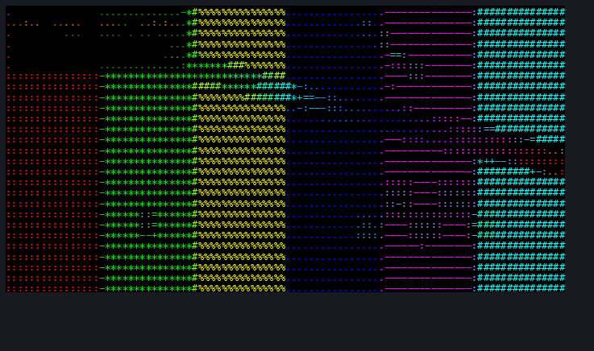

# contourtty


contourtty is a C++20 terminal media renderer for live video, webcam, and stream playback as structure-aware ASCII: glyphs are selected from edge direction and shape, not brightness alone, while keeping audio/video sync in a native terminal UI.



## Status

Pre-alpha. Local video now plays as paced luminance or structure ASCII in truecolor or mono terminals with audio sync. Webcam/stream inputs, exports, and packaging are still pending.

## Build and run

```sh
cmake --preset ci
cmake --build --preset ci
./build/ci/contourtty <video-file>
```

## Runtime notes

With audio present, video is paced from the audio playback clock. Late video frames are dropped once they fall too far behind the clock, capped at 50ms, so playback holds sync instead of accumulating lag. `--max-fps N` decimates rendered video frames for slow terminals while audio continues; `--log FILE` records rendered/dropped frame counts and drift.

Structure mode overlays shape-matched edge glyphs over the luminance fill. `--edge-strength 0` disables the overlay, values below `1` make edges stricter, and values above `1` make edges more aggressive.

Controls: `space` pauses/resumes audio and video together, left/right arrows seek -/+5s, and `q` quits.

## Name

Chosen name: `contourtty`.

Public namespace checks on 2026-06-18:

- GitHub user/org path: `https://github.com/contourtty` returned 404.
- GitHub public repository search: no exact `contourtty` repository name in the first 100 `in:name` matches.
- Homebrew Formula API: `https://formulae.brew.sh/api/formula/contourtty.json` returned 404.
- Homebrew Cask API: `https://formulae.brew.sh/api/cask/contourtty.json` returned 404.
- Saturated names rejected: `timg`, `tplay`, `chafa`, `ascii-video-player`.
- Alternatives rejected: `strok` (`https://github.com/strok` exists), `glyph`/`hatch` (Homebrew collisions), `glyphstream`/`etch`/`inkterm` (GitHub exact-repo collisions).

## License

MIT.
