# kumeyuri

Mermaid, animated. Anywhere text renders.

Project direction: [NORTHSTAR.md](./NORTHSTAR.md)

Docs: [docs/book](./docs/book/index.md)

Adoption: [docs/adoption.md](./docs/adoption.md)

Compatibility dashboard: [docs/book/compat-dashboard.md](./docs/book/compat-dashboard.md)

Migration audit: `kumeyuri audit-mermaid ./docs`

Website: [site](./site/index.html)

Examples: [examples](./examples/README.md)

Demos: [demos](./demos/README.md)
