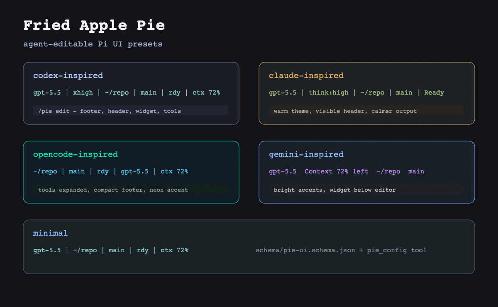

# Fried Apple Pie

Agent-editable Pi UI presets, themes, and config. 16 presets, 7 personas, one `pie_config` tool the Pi agent can drive directly.

<div align="center">
  
</div>

```sh
pi install npm:fried-apple-pie
```

```txt
/pie gallery        live-cycle every preset
/pie preset <name>  apply a preset
/pie persona <name> swap working spinner + verbs
```

## Why

Pi already supports themes, extensions, and packages. Existing packages each cover one slice — a theme pack, a footer, a tool renderer. Fried Apple Pie is a **composition layer**:

- 16 presets covering cross-agent looks (claude / codex / gemini / opencode / aider / copilot / cursor / amp) and popular color schemes (dracula / tokyo-night / catppuccin / nord / gruvbox).
- One `pie_config` tool that lets the Pi agent itself read, validate, patch, and apply UI config — no other Pi customization package exposes this.
- Trust-aware global + project scope, JSON Patch subset, `/pie doctor` conflict detection, `npm test` shipped.

## Migrate from another agent

If you're moving to Pi from another CLI agent and miss the look:

```sh
pi install npm:fried-apple-pie

pi /pie preset claude-inspired    # claude code look
pi /pie preset codex-inspired     # openai codex look
pi /pie preset gemini-inspired    # gemini cli look
pi /pie preset opencode-inspired  # opencode look
pi /pie preset aider-inspired     # aider terse footer
pi /pie preset copilot-inspired   # github copilot dense
```

These are **inspired presets**, not exact clones.

## Install

```sh
pi install npm:fried-apple-pie       # published
pi install .                         # from a checkout
pi -e .                              # one-shot local run
```

After install, run `/pie welcome` to see active config and the command list.

## Presets

Cross-agent inspired (layout + theme):

- `minimal` — single footer line, no header, terse spinner
- `claude-inspired` — header + thinking segment, dots spinner
- `opencode-inspired` — pipe-separated footer, widget hint, expanded tools
- `codex-inspired` — dense footer with tokens, arc spinner
- `gemini-inspired` — bright header, below-editor widget, expanded tools
- `aider-inspired` — no header, terse 3-segment footer
- `copilot-inspired` — dense GitHub-style, full footer with thinking
- `cursor-inspired` — charcoal + electric blue with widget hint
- `amp-inspired` — warm amber, compact tool pills

Theme-only (minimal layout, popular color schemes):

- `dracula` — purple+cyan
- `tokyo-night` — blue+magenta
- `catppuccin-mocha` — mauve+sky pastel (dark)
- `catppuccin-latte` — mauve+sky pastel (light)
- `nord` — frost blue
- `gruvbox-dark` — warm yellow+green (dark)
- `gruvbox-light` — warm yellow+green (light)

## Personas

Persona is an orthogonal axis to preset. Controls working spinner + per-turn verb rotation only; does not touch layout or theme.

- `default` — dots spinner, "Working / Thinking / Processing"
- `terse` — line spinner, "Working"
- `arc` — arc spinner, "Working / Reasoning"
- `startrek` — dots3 spinner, "Engaging warp drive / Running diagnostics / Hailing frequencies"
- `medieval` — triangle spinner, "Forging / Conjuring / Questing"
- `pirate` — moon spinner, "Plunderin' / Hoistin' sails / Searchin' the seas"
- `mlengineer` — aesthetic bar spinner, "Tuning / Training / Evaluating"

Each preset has a default persona. Override with `/pie persona <name>` or set `persona` in `pie-ui.json`.

## Commands

```txt
/pie                           open preset picker overlay
/pie preset <name> [clean|merge]   apply preset (default: clean)
/pie mode <full|theme-only|footer-only|widgets-only|status-only>
/pie persona <name>            swap spinner + verb pack
/pie gallery                   live-cycle every preset (no writes)
/pie diff <preset> [merge]     preview what a preset apply would change
/pie history                   show last preset switches
/pie undo                      restore previous preset state
/pie import <path>             import a pie-ui.json from a local file
/pie capture                   render the active preset's tape with vhs (needs vhs+ttyd+ffmpeg)
/pie edit                      interactive config editor
/pie welcome                   show active config + command list
/pie show                      dump loaded config (global + project + effective)
/pie export                    dump effective config only
/pie doctor [strict]           validate config, detect conflicts, check capture deps
/pie reset                     return to minimal preset
```

`/pie gallery` controls: `j`/`l` next, `k`/`h` previous, `enter` keep current preview, `q` restore prior config.

## Keybindings

`ctrl+alt+p` opens the Fried Apple Pie leader. Then press `p` preset picker, `g` gallery, `s` footer segments, `e` editor, `d` doctor, or `c` capture.

`ctrl+p` is also registered, but Pi's default `app.model.cycleForward` binding reserves `ctrl+p`, so Pi skips that extension shortcut until you rebind the model cycle action in `~/.pi/agent/keybindings.json` and run `/reload`.

```json
{
  "app.model.cycleForward": "ctrl+alt+right",
  "app.model.cycleBackward": "ctrl+alt+left"
}
```

## Agent tool

The package registers `pie_config` so the Pi agent can change the UI without guessing file format.

Actions:

- `read` — return global, project, and effective config.
- `list_presets` — return preset → config map.
- `validate` — validate a config or the current effective one (`strict?: boolean`).
- `patch` — apply a JSON Patch (`add`, `replace`, `remove`) to a scope. `dryRun: true` returns the would-be result.
- `apply` — write a full config to a scope. `dryRun: true` validates without writing.
- `set_preset` — convenience: set preset + theme (`applyMode: "clean" | "merge"`).
- `set_footer_segments` — convenience: set `footer.segments`.
- `toggle_compact` — flip `compact`.
- `set_theme` — set theme by name.

Scopes: `global` (`~/.pi/agent/pie-ui.json`), `project` (`<cwd>/.pi/pie-ui.json`, requires project trust), `effective` (read-only; useful with `dryRun`).

JSON Schema: [`schema/pie-ui.schema.json`](./schema/pie-ui.schema.json). Use `{ "$schema": "./schema/pie-ui.schema.json", ... }` to get editor autocomplete.

## Config example

```json
{
  "$schema": "./schema/pie-ui.schema.json",
  "preset": "codex-inspired",
  "theme": "fried-apple-pie-codex",
  "persona": "arc",
  "mode": "full",
  "compact": true,
  "footer": {
    "enabled": true,
    "segments": ["model", "thinking", "cwd", "branch", "status", "context", "tokens"]
  },
  "header": {
    "enabled": true,
    "title": "Codex-inspired",
    "subtitle": "dense agent workspace"
  },
  "welcome": {
    "enabled": true
  },
  "tools": {
    "expanded": false
  }
}
```

Footer segments: `model`, `thinking`, `cwd`, `branch`, `status`, `context`, `tokens`, `cost`, `preset`. Each entry can also be conditional: `{ "id": "cost", "when": "context>70" }`. Available `when` rules: `always`, `git-repo`, `trusted-project`, `context>50`, `context>70`, `context>90`, `tokens>10k`.

Modes (what surface the extension owns):
- `full` — header + footer + widget + theme.
- `theme-only` — only theme.
- `footer-only` — footer + theme.
- `widgets-only` — widget + theme.
- `status-only` — theme + a small `setStatus` surface showing preset + ctx; no header/footer/widget ownership. Best for coexisting with `pi-powerline-footer` or other footer/widget owners.

Optional `notifications`:
- `contextWarnings: false` — suppress the automatic context-usage warnings (70% info / 90% warning).

Optional `welcome`:
- `enabled: false` — suppress the startup ASCII banner.
- `banner: ["line 1", "line 2"]` — override the bundled preset banner.

## Layers (compose decorations)

`layers` is an array of small named overlays applied between the preset and your raw config. Use it to mix preset bones with theme/footer/persona variants.

```json
{
  "preset": "codex-inspired",
  "layers": ["theme:gemini", "footer:powerline", "persona:terse"]
}
```

Categories shipped:

- `theme:*` — claude, codex, gemini, opencode, dracula, nord, tokyo-night, catppuccin-mocha, gruvbox-dark.
- `footer:*` — minimal, dense, powerline, none.
- `welcome:*` — on (widget hint), none (no header + no widget).
- `persona:*` — default, terse, arc, startrek, medieval, pirate, mlengineer.
- `compact:*` — on, off.

Resolve order: `DEFAULT_CONFIG → PRESETS[preset] → layers[0..n] → user raw config`. Your raw config always wins.

Preset apply modes:
- `clean` — reset preset-owned config (header, footer, widget, tools, thinking).
- `merge` — keep your overrides on top of the preset.

## Comparison

|                              | fried-apple-pie | tweakcc (CC) | amp-themes (Pi) | pi-powerline-footer | ccstatusline (CC) | lualine (nvim) | opencode |
|------------------------------|-----------------|--------------|-----------------|---------------------|-------------------|----------------|----------|
| Multi-preset switch          | **16**          | —            | —               | —                   | scripted          | themes         | themes   |
| Spinners / personas          | **10 / 7**      | 70+ / lib    | —               | AI "vibes"          | —                 | n/a            | n/a      |
| Boot/welcome ASCII           | startup banner  | sign-in art  | —               | branded splash      | —                 | winbar         | —        |
| Conditional segments         | **yes**         | n/a          | n/a             | context-warn        | flexible          | richest        | —        |
| Capture / share              | capture / share planned | —     | —               | —                   | —                 | n/a            | n/a      |
| Doctor / conflict check      | **yes**         | —            | —               | —                   | —                 | n/a            | —        |
| Agent-readable config        | **yes**         | —            | —               | —                   | —                 | n/a            | —        |
| JSON Patch agent API         | **yes**         | —            | —               | —                   | —                 | n/a            | —        |
| Trust-aware scope            | global+project  | —            | —               | —                   | yes               | n/a            | yes      |
| Tests shipped                | **yes**         | partial      | —               | —                   | —                 | yes            | —        |

## Compatibility with other Pi packages

Fried Apple Pie owns `header`, `footer`, `widget`, `theme`, `tools-expanded`, `thinking-label`, and `working-indicator` while enabled. If another package owns one of those surfaces, run `/pie doctor` to spot the conflict and set a compatibility mode.

Known co-existence pairings (use `/pie doctor` to detect):

- [`pi-powerline-footer`](https://github.com/nicobailon/pi-powerline-footer) — owns footer + welcome splash. Set `mode: theme-only` or `mode: widgets-only`.
- [`pi-tool-display`](https://github.com/MasuRii/pi-tool-display) — owns tool rendering. Keep `mode: full` with `tools.expanded: false`.
- [`amp-themes`](https://pi.dev/packages/amp-themes) / [`@smoose/pi-themes`](https://pi.dev/packages/@smoose/pi-themes) / [`pi-ansi-themes`](https://github.com/leblancfg/pi-ansi-themes) / [`pi-coding-agent-catppuccin`](https://github.com/otahontas/pi-coding-agent-catppuccin) — own theme. Set `mode: footer-only` or `mode: widgets-only` to keep their theme.
- [`tintinweb/pi-subagents`](https://github.com/tintinweb/pi-subagents) — bundles a fixed Claude Code aesthetic. Set `mode: theme-only` if you want to keep its sub-agent UI.

## Verify

```sh
npm install
npm run verify   # typecheck + tests
npm run smoke:pi # boot Pi against this extension offline
```

## License

MIT.
