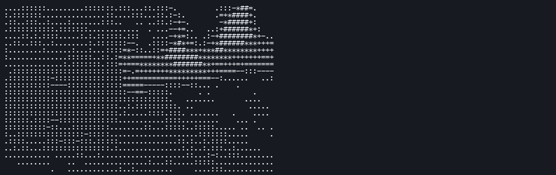

# contourtty


contourtty is a C++20 terminal media renderer for live video, webcam, and stream playback as structure-aware ASCII: glyphs are selected from edge direction and shape, not brightness alone, while keeping audio/video sync in a native terminal UI.



Demo source: public-domain Wikimedia Commons footage; luminance is left, structure mode is right. See [docs/demo-source.md](docs/demo-source.md).

## Status

Pre-alpha. Local video, images, animated GIFs, image grids, asciinema casts, numeric stdin plots, OBJ scenes, camera input, direct FFmpeg stream URLs, and YouTube URLs via yt-dlp now play as paced luminance or structure ASCII with audio sync where audio is present. MP4 export writes rasterized ASCII video with muxed AAC audio when the source has audio; ANSI, asciinema, PNG still snapshots, sidecar captions, and Kitty/iTerm pixel emitters are implemented and covered by local tests. Published release artifacts are still pending.

## Build and run

```sh
cmake --preset ci
cmake --build --preset ci
./build/ci/contourtty <video-file>
```

One-line dependency setup: macOS uses `brew install cmake pkg-config ffmpeg freetype zlib`; Debian/Ubuntu uses `sudo apt-get install cmake pkg-config libavformat-dev libavcodec-dev libavdevice-dev libavutil-dev libswscale-dev libswresample-dev libfreetype-dev zlib1g-dev`.

Minimal CPU-only build:

```sh
cmake -S . -B build/light -DCMAKE_BUILD_TYPE=Release -DCONTOURTTY_LIGHT=ON
cmake --build build/light --target contourtty --parallel
```

`CONTOURTTY_LIGHT=ON` skips optional Apple Metal linkage and uses the CPU analysis path; Vulkan, shader cross-compilation, and Sixel are not linked in the current tree.

Runtime dependency: contourtty links against system FFmpeg libraries (`libavformat`, `libavcodec`, `libavdevice`, `libavutil`, `libswscale`, `libswresample`), FreeType, and zlib. On macOS, install them with `brew install ffmpeg freetype zlib`; on Debian/Ubuntu, install the matching `libav*-dev`, `libfreetype-dev`, and shared runtime packages for packaged binaries.

Install from source:

```sh
cmake -S . -B build/release -DCMAKE_BUILD_TYPE=Release
cmake --build build/release
cmake --install build/release --prefix /usr/local
```

Package locally:

```sh
scripts/package_release.sh
```

The package script emits a `.tar.gz` on macOS/Linux and a `.deb` on Linux. A head-only Homebrew formula is available at `packaging/homebrew/contourtty.rb`; install it with `brew install --HEAD ./packaging/homebrew/contourtty.rb`.

## Runtime notes

With audio present in local files, video is paced from the audio playback clock. Remote streams and camera input use wall-clock pacing to avoid full audio predecode before playback. Late video frames are dropped once they fall too far behind the clock, capped at 50ms, so playback holds sync instead of accumulating lag. `--max-fps N` decimates rendered video frames for slow terminals while audio continues; `--log FILE` records rendered/dropped frame counts and drift.

Structure overlay replaces high-edge cell glyphs while preserving the active blitter colors. `--structure-overlay auto` enables it for `--mode structure` or structure-tuning flags, `on` forces it for modes such as octant/sextant/braille/halfblock/blocks, and `off` disables it. `--line-ligatures` post-processes structure edges into box-drawing joins. `--edge-strength 0` disables edge picks, values below `1` make edges stricter, and values above `1` make edges more aggressive.

Styles insert NPR pre/post passes into the render graph. `--style painterly` runs a directional Kuwahara pre-pass before luminance and structure analysis to flatten local color regions while preserving hard contours. `--style hatch` replaces structure overlay with ETF-smoothed crosshatch glyphs driven by edge orientation and shade density. `--style stipple` replaces cell glyphs with a checked-in 64x64 blue-noise rank tile; `--mode braille` and `--mode octant` use 2x4 sub-cell dot carriers. `--style flow` replaces structure overlay with ETF-guided LIC strokes; `--lic-length N` controls the trace length. `--style cell-shade` is for scene inputs: it uses the OBJ G-buffer's normals and depth for orientation hatching and shade shifts. `--posterize N` quantizes OKLab L into perceptual shade buckets before glyph and terminal color quantization.

Structure knobs: `--mode luminance` uses the brightness ramp, `--mode structure` enables shape-aware edge glyphs, `--edge-threshold N` sets the minimum edge magnitude, `--dog-sigma N[,M]` enables DoG line isolation (`0` disables it), `--etf-iters N` smooths the Sobel orientation field and applies a CLD edge field, `--posterize N` buckets OKLab L before glyph selection, `--contrast N` boosts structure separation, `--glyph-stickiness N` keeps near-tied structure glyphs stable across frames, `--orient-stickiness N` keeps near-tied directional edge buckets stable, and `--charset NAME|string` replaces the luminance ramp. Presets: `standard`, `blocks`, `detailed`, `binary`, `portrait-30`, `lineart-40`, `blueprint-24`, and `braille`; `portrait-30` is density-rich for faces/figures, `lineart-40` emphasizes strokes/corners, and `blueprint-24` keeps thin technical geometry. `--mode braille` packs a 2x4 luminance grid into each Unicode braille cell with separate foreground/background averages; `--charset braille` remains accepted as a packed-renderer alias. `--font PATH` uses FreeType rasterization for structure glyph analysis and MP4 glyph rasterization. `--ramp-sort` sorts the active ramp by FreeType ink density, so it requires `--font` unless the active charset is `braille`. `--glyph-features hog` swaps shape matching from the legacy 9-region overlap vector to a 32-D HoG vector; `--glyph-features sdf` uses signed-distance overlap features. `--gpu` uses the optional Metal structure-analysis backend for DoG, Sobel, glyph choice, and per-cell averages on macOS when available, and falls back to CPU elsewhere.

Image inputs: PNG/JPG/WebP render once and hold until `q`; animated GIFs loop with source frame timing. `--grid CxR` treats a globbed image input as a fitted contact sheet and keeps animated GIF tiles on their own timelines.

Scene inputs: `.obj` files and bundled aliases such as `contourtty:scene:cube` render through the tiny CPU rasterizer. `--scene-camera turntable|orbit|fly` selects the rotation preset; `--style cell-shade` uses the scene depth and normal buffers.

Data and terminal-recording inputs: `--input stdin --plot waveform|spectrum|heatmap` renders numeric streams, and `.cast` inputs replay asciinema v2 recordings through the same renderer.

Layout: `--width` and `--height` set render bounds, `--fit` clamps those bounds to the current terminal, output is centered, resize recomputes the fit and repaints, and `--loop` restarts video input at EOF.

Stream inputs: direct FFmpeg URLs such as HLS/HTTP/RTSP are passed through to libav. YouTube URLs require `yt-dlp`; contourtty resolves them with `yt-dlp -g` and fails with a clear install/direct-URL message when it is missing. Set `CONTOURTTY_YTDLP` to override the resolver binary path.

Camera inputs: use `--input cam` for the platform default (`avfoundation` on macOS, `v4l2` on Linux, `dshow` on Windows) or pass an explicit device alias such as `avfoundation:0`, `v4l2:/dev/video0`, or `dshow:video=Integrated Camera`. Live capture requests 640x480 at 30 fps for low-latency structure analysis. Camera playback mirrors horizontally by default; pass `--no-mirror` for sensor-native orientation.

Capability detection uses environment variables, an allowlist, and optional FreeType font cmap checks only; it does not issue terminal query escapes. `--caps dump` prints the resolved capability set; override specs are comma-separated, for example `--caps unicode=16,octant,truecolor`.

Color defaults to truecolor when `COLORTERM=truecolor` or `24bit`, 256-color when `TERM` contains `256`, otherwise 16-color. `NO_COLOR` forces mono. `--color-mode` overrides detection; 256/16 output is palette-quantized. `--dither ordered` applies Bayer dithering; `--dither fs` applies CPU-side Floyd-Steinberg error diffusion, which is serial by design and not parallelized. `--diff-oklab-eps N` suppresses truecolor SGR re-emits when only sub-perceptual OKLab color deltas changed.

`--mode halfblock` renders with upper-half block cells: foreground is sampled from the top half, background from the bottom half, doubling vertical color resolution in truecolor/256-color terminals. `--mode blocks` uses SAD over shade and quadrant block glyph bitmaps for 2x2 subcell luminance detail. `--mode braille` packs a 2x4 luminance grid into Unicode braille cells with truecolor fg/bg averages. `--mode octant` packs a 2x4 luminance grid into Unicode 16 octant block glyphs with separate foreground/background averages; `--mode sextant` uses the Unicode 13 2x3 fallback set.

Controls: `space` pauses/resumes audio and video together, left/right arrows seek -/+5s, and `q` quits.

Export: `--export out.mp4` writes rasterized ASCII video and muxes source audio as AAC when present; `--export out.ansi` writes the raw ANSI escape stream, replayable with `cat out.ansi`; `--export out.cast` writes asciinema v2 output. `--still hero.png` writes one rasterized PNG snapshot, optionally seeking first with `--still-at HH:MM:SS`. `--captions out.srt` writes deterministic frame-summary captions. Export uses the same renderer and honors width/height, mode, charset, color, and dither flags.

Config: defaults are read from `$XDG_CONFIG_HOME/contourtty/config`, or `~/.config/contourtty/config` when `XDG_CONFIG_HOME` is unset. The file is simple `key=value` syntax using flag names without `--`, for example `pipeline=structure`, `mode=structure`, or `charset=" .#"`; CLI flags override config defaults. `--graph FILE.yaml` loads the in-tree graph YAML subset used by examples under `share/contourtty/graphs/`.

## Flag reference

| Flag | Meaning |
|---|---|
| `--help` | Show CLI help. |
| `--version` | Show version. |
| `--width N` | Target terminal columns or export columns. |
| `--height N` | Target terminal rows or export rows. |
| `--input PATH\|URL\|cam\|stdin` | Input path, stream URL, camera alias, or stdin plot data. |
| `--cell-aspect N` | Terminal cell width/height ratio; default is `0.5`. |
| `--fit`, `--no-fit` | Clamp output to terminal, or disable config-default fit. |
| `--fps N` | Override source fps for playback/export pacing. |
| `--max-fps N` | Cap rendered fps while preserving audio timing. |
| `--mode auto\|luminance\|structure\|halfblock\|blocks\|octant\|sextant\|braille` | Select renderer. |
| `--style none\|painterly\|hatch\|stipple\|flow\|cell-shade` | Insert a stylized render-graph pre/pass set. |
| `--render-mode auto\|text\|pixel\|hybrid` | Select text, graphics-protocol pixel, or hybrid output; `auto` falls back to text when unsupported. |
| `--structure-overlay auto\|on\|off` | Overlay structure contours over the active blitter. |
| `--pipeline auto\|luminance\|structure\|halfblock\|blocks\|octant\|sextant\|braille` | Select a render-graph preset; overrides config `pipeline`. |
| `--font PATH` | Use a FreeType font for structure glyph analysis and MP4 export glyph rasterization. |
| `--glyph-features overlap\|hog\|sdf` | Select the structure shape-matching feature vector. |
| `--ramp-sort`, `--no-ramp-sort` | Sort the active ramp by FreeType ink density, or disable config-default sorting. |
| `--color-mode auto\|truecolor\|256\|16\|mono` | Select color tier. |
| `--color auto\|truecolor\|256\|16\|mono` | Alias for `--color-mode`. |
| `--mono`, `--no-mono` | Force mono, or restore automatic color detection. |
| `--charset NAME\|string` | Glyph preset or custom UTF-8 glyph ramp. |
| `--edge-threshold N` | Minimum structure edge magnitude. |
| `--edge-strength N` | Structure overlay multiplier; `0` disables edges. |
| `--dog-sigma N[,M]` | Difference-of-Gaussians sigma pair; `0` disables DoG. |
| `--dog-threshold N` | DoG response threshold. |
| `--etf-iters N` | Smooth the structure orientation field before edge glyph selection. |
| `--lic-length N` | Set `flow` style convolution length, 1..64. |
| `--posterize N` | Quantize OKLab L before glyph and terminal color quantization, 2..64. |
| `--contrast N` | Structure analysis contrast boost. |
| `--glyph-stickiness N` | Retain near-tied structure glyphs across frames, `0..1`. |
| `--orient-stickiness N` | Retain near-tied structure edge orientations in radians. |
| `--dither none\|ordered\|fs` | Palette dithering mode. |
| `--diff-oklab-eps N` | Suppress color-only diff emits below an OKLab distance threshold. |
| `--bandwidth-cap N` | Graphics protocol cap in MB/s, default `50`. |
| `--loop`, `--no-loop` | Loop video input, or disable config-default looping. |
| `--mirror`, `--no-mirror` | Enable or disable horizontal mirroring for camera playback. |
| `--log FILE` | Write diagnostics. |
| `--gpu`, `--no-gpu` | Request or disable the optional GPU analysis path. |
| `--line-ligatures`, `--no-line-ligatures` | Use box-drawing joins for structure edges, or disable config-default joins. |
| `--debug-stats`, `--no-debug-stats` | Show or hide live FPS, CPU, and RSS diagnostics during playback; samples are also written when `--log` is set. |
| `--input-keys TEXT` | Queue literal playback keys for automated terminal-flow tests. |
| `--graph dump\|FILE.yaml` | Print the resolved render graph or load a graph file. |
| `--split LEFT:RIGHT` | Render two pipelines side-by-side; left/right arrows move the seam. |
| `--grid CxR` | Render matched image inputs as a contact sheet. |
| `--plot waveform\|spectrum\|heatmap` | Render numeric stdin as a data plot. |
| `--overlay PATH\|SOURCE` | Overlay a scene source over the primary input. |
| `--overlay-alpha N` | Scene overlay opacity, `0..1`. |
| `--overlay-depth-threshold N` | Maximum scene depth blended over the primary input. |
| `--captions FILE.srt` | Write deterministic frame-summary SubRip captions. |
| `--plot-window N` | Rolling sample count for stdin plots. |
| `--plot-rate N` | Refresh rate for stdin plots. |
| `--scene-camera turntable\|orbit\|fly` | Select scene camera preset. |
| `--caps dump\|SPEC` | Print or override terminal capability detection. |
| `--export FILE` | Offline export to `.mp4`, `.ansi`, or `.cast`. |
| `--still FILE.png` | Write one rendered PNG snapshot. |
| `--still-at HH:MM:SS[.ffffff]` | Seek timestamp before writing `--still`. |
| `--dump-frame N` | Decode frame `N` for diagnostics. |
| `--dump-png FILE` | Write dumped frame as RGB PNG. |

## How structure mode works

Structure mode still starts from the same decoded RGB frame and terminal layout as luminance mode, but it adds analysis passes before glyph selection:

```text
RGB frame -> optional style pre-pass -> luminance -> contrast/DoG -> Sobel
          -> optional ETF/optical-flow/temporal history
          -> cell colors + edge field -> glyph choice -> optional style overlay
          -> CellBuffer -> text/pixel/hybrid emitter
```

The luminance renderer picks a glyph from the brightness ramp for every cell. Structure mode keeps that brightness glyph as a fallback, then detects directional edges in the cell. Strong vertical, horizontal, and diagonal gradients map to structure glyphs such as `|`, `_`, `/`, `\`, and `+`.

When shape matching is enabled, the edge magnitude field inside the cell is sampled into a compact shape vector and compared against precomputed vectors for the structure glyph set. This lets the renderer choose by local stroke shape rather than by brightness alone. DoG (`--dog-sigma`) can isolate line-like detail before Sobel, ETF (`--etf-iters`) smooths noisy edge orientations before glyph choice, `--contrast` can widen separation in low-contrast footage, `--glyph-stickiness` uses optical-flow-warped glyph history to reduce near-tie flicker, and `--orient-stickiness` stabilizes fallback directional edge buckets.

Benchmarks: [BENCHMARKS.md](BENCHMARKS.md).

`--graph dump --mode structure` prints the resolved pass DAG with each pass backend and typed inputs/outputs, matching the pipeline documented above. `--graph share/contourtty/graphs/structure.yaml` loads the default structure graph; `share/contourtty/graphs/painterly_hatch_stipple.yaml` shows multi-pass style composition.

## Name

Chosen name: `contourtty`.

Public namespace checks on 2026-06-18:

- GitHub user/org path: `https://github.com/contourtty` returned 404.
- GitHub public repository search: no exact `contourtty` repository name in the first 100 `in:name` matches.
- Homebrew Formula API: `https://formulae.brew.sh/api/formula/contourtty.json` returned 404.
- Homebrew Cask API: `https://formulae.brew.sh/api/cask/contourtty.json` returned 404.
- Saturated names rejected: `timg`, `tplay`, `chafa`, `ascii-video-player`.
- Alternatives rejected: `strok` (`https://github.com/strok` exists), `glyph`/`hatch` (Homebrew collisions), `glyphstream`/`etch`/`inkterm` (GitHub exact-repo collisions).

## License

MIT.
