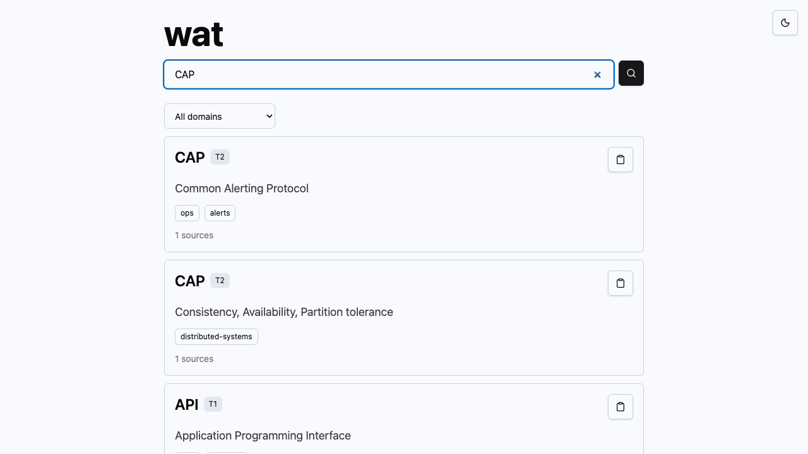

# wat

   

Layered glossary lookup for tech acronyms and team jargon. wat prioritizes in-workflow lookup for Slack first, then Teams and other company chat surfaces, with web kept as API/admin infrastructure.



## Maturity

| Path | Status | Use now |
| --- | --- | --- |
| Local demo | Works | Run the web app against checked-in seed data. |
| Self-host | Experimental | Compose/Postgres docs and scripts exist; some product state is still in-memory outside the Slack install path. |
| Hosted beta | Not live | Hosted auth/provider verification, production monitoring evidence, and distribution smoke tests are still TODO; DB-backed overlays and per-team keys exist. |
| Browser extension | Developer build | Build locally or deploy by enterprise policy; login/pairing and store releases are TODO. |
| Slack | Priority app | Socket Mode runtime, OAuth callback, encrypted JSON/Postgres install storage, uninstall cleanup, metrics, Bolt handlers, auth headers, admin checks, DB-backed suggestions, and rate limits exist. |
| Teams | P1 scaffold | API-based message-extension search package, DB tenant mapping, and protected metrics exist; SSO, writes, and admin flows need later bot/auth work. |
| Discord | Integration-ready scaffold | Signed HTTP interactions, slash/message commands, DB guild mapping, suggestions, admin-gated defines, command registration, and metrics exist. |
| MCP | Local stdio + HTTP server | Works from a clone after build against the web API; npm package, hosted endpoint, and catalog listings are TODO. |

See [Limitations](docs/limitations.md) for the current unsupported areas. Namespace/domain checks are recorded in [Project Identity](docs/project-identity.md).

## Local Demo

```sh
corepack enable && pnpm demo:local
```

The command installs dependencies, starts Postgres and Mailpit with Docker Compose, applies migrations on a clean local DB, seeds the public corpus, and starts the web app.

Open `http://localhost:3000` and Mailpit at `http://localhost:8025`.

## Install Paths

Open `/install` in the web app for role- and environment-specific setup paths for web, browser extension, Slack, Teams, Discord, MCP, API, and self-host installs.

Self-host operators should also follow [Self-Host](docs/self-host.md) and [Migration Runbook](docs/migration-runbook.md) for migrations, backups, restore, rollback, and secret rotation.

## Workspace

- `apps/web`: Next.js API, auth, admin, install, and review routes
- `apps/slack`: Slack app runtime and handlers
- `apps/teams`: Teams API-based message extension app package
- `apps/discord`: Discord signed interactions runtime and command registration
- `apps/mcp`: MCP server scaffold
- `apps/lsp`: LSP hover server for editor integrations
- `extensions/browser`: browser extension scaffold
- `packages/core`: shared schema, normalization, validation, merge logic
- `packages/db`: Drizzle schema and migrations
- `packages/search`: ranking and search primitives
- `packages/ingest`: corpus ingestion helpers and scraper utilities

## Current Features

- public seed corpus with cited entries
- instant web search backed by public seed data plus signed-in team and personal overlays
- privacy-safe search analytics dashboard with query hashes, layer hits, confidence buckets, no-result rate, and latency
- disambiguated result cards with source counts and confidence chips
- domain filtering and keyboard navigation
- Markdown citation copy buttons
- entry permalinks, share links, and generated Open Graph images
- corpus stats at `/stats`

## Checks

```sh
pnpm lint
pnpm typecheck
pnpm build
pnpm --filter @wat/core test
pnpm --filter @wat/search test
pnpm --filter @wat/ingest test
```

## Docs

- [Architecture](docs/architecture.md)
- [API](docs/api.md)
- [Contributing](docs/contributing.md)
- [Developer architecture](docs/developer-architecture.md)
- [Discord](docs/discord.md)
- [Limitations](docs/limitations.md)
- [Migration runbook](docs/migration-runbook.md)
- [MCP configuration](docs/mcp.md)
- [Platform strategy](docs/platform-strategy.md)
- [Production readiness](docs/production-readiness.md)
- [Security](docs/security.md)
- [Security model](docs/security-model.md)
- [Team admin guide](docs/team-admin-guide.md)
- [Teams](docs/teams.md)
- [Troubleshooting](docs/troubleshooting.md)

## Security Reports

Report vulnerabilities privately to <angryapplegravy@gmail.com> or through the GitHub security policy for this repository. Do not post exploit details in public issues.
