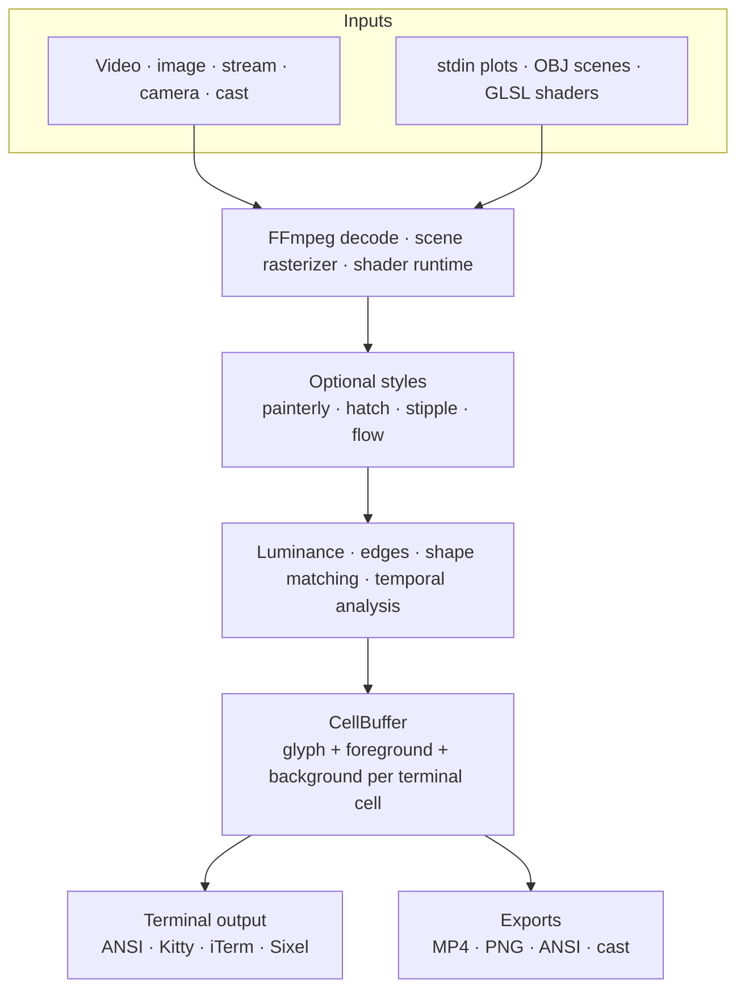

[](https://github.com/gongahkia/strok/releases/tag/1.0.0) 


# `strok` 🎨

A [structure-aware](https://arxiv.org/abs/2609.24616) media renderer entirely in the [CLI](#architecture).

## Rationale

While most other [ASCII](https://en.wikipedia.org/wiki/ASCII)/[ANSI](https://stackoverflow.com/questions/701882/what-is-ansi-format) renderers select and filter out glyphs by their brightness alone, `Strok` utilises the raw edges, orientation, and local shapes inherent within media to output [streams](https://hyperskill.org/learn/step/8837) with greater fidelity.

For the nerds, `Strok` also optionally transforms inputs by adding painterly, hatch, stipple, flow, posterization, DoG, ETF, line-ligature & temporal-stability passes to the [render graph](https://logins.github.io/graphics/2021/05/31/RenderGraphs.html).

## Stack

* Scripting: [C++20](https://en.cppreference.com/w/cpp/20), [CMake](https://cmake.org/), [FreeType](https://freetype.org/)
* Media: [FFmpeg](https://ffmpeg.org/), [zlib](https://zlib.net/), [miniaudio](https://miniaud.io/) 
* GPU: [Metal](https://developer.apple.com/metal/), [Vulkan](https://www.vulkan.org/) 
* Tests: [CTest](https://cmake.org/cmake/help/latest/manual/ctest.1.html)

## Features

* Consumes, parses and plays the following input formats
    * Video
    * Images
    * Animated GIFs
    * Image grids
    * Asciinema casts
    * Numeric stdin plots 
    * OBJ scenes
    * Live camera input
    * Direct FFmpeg URLs
    * YouTube URLs
* Syncs audio and video streams 
* Handles live camera/RTSP reconnects
* Exposes profiles for live, structure and low-bandwidth outputs
* Emits ANSI text by default & optionally supports the below 
    * [Kitty](https://sw.kovidgoyal.net/kitty/) graphics
    * [iTerm2](https://iterm2.com/) inline images
    * [Sixel](https://en.wikipedia.org/wiki/Sixel)
    * [Hybrid](https://www.sciencedirect.com/science/article/abs/pii/S0167865504000224) text/pixel output 
* Extensibly supports custom ramps and font-backed shape matching
* Exports to rasterized MP4, PNG stills, ANSI streams & asciinema casts

## GIF

<div align="center">
  
  <p><sub>Bundled OBJ scene with normal-map colour and an orbit camera.</sub></p>
  
  <p><sub>Bundled Shadertoy-style shader input rendered as ASCII.</sub></p>
  
  <p><sub>Six seconds of public-domain video beside its shape-aware hatch output.</sub></p>
</div>

## Architecture


```mermaid
flowchart TD
  subgraph inputs [Inputs]
    media[Video · image · stream · camera · cast]
    generated[stdin plots · OBJ scenes · GLSL shaders]
  end

  acquire[FFmpeg decode · scene rasterizer · shader runtime]
  styles["Optional styles<br/>painterly · hatch · stipple · flow"]
  analysis[Luminance · edges · shape matching · temporal analysis]
  cells["CellBuffer<br/>glyph + foreground + background per terminal cell"]
  terminal["Terminal output<br/>ANSI · Kitty · iTerm · Sixel"]
  exports["Exports<br/>MP4 · PNG · ANSI · cast"]

  media --> acquire
  generated --> acquire
  acquire --> styles --> analysis --> cells
  cells --> terminal
  cells --> exports
```

## Usage

The below instructions are for running `Strok` locally.

1. First, run the below to clone the repository.

```console
$ git clone https://github.com/gongahkia/strok && cd strok
```

2. Then execute the below commands to install build and media dependencies.

```console
$ brew install cmake pkg-config ffmpeg freetype zlib

$ sudo apt-get update

$ sudo apt-get install -y build-essential cmake dpkg-dev file pkg-config \
    libavformat-dev libavcodec-dev libavdevice-dev libavutil-dev \
    libswscale-dev libswresample-dev libfreetype-dev zlib1g-dev
```

3. Next, configure, build & inspect the local runtime with these commands.

```console
$ cmake --preset ci
$ cmake --build --preset ci --parallel
$ ./build/ci/strok --doctor
```

4. Finally, play a file using the built-in scene or start a camera session. 
    1. Press `q` to quit
    2. Press `space` to pause 
    3. Press `left` and `right` arrows to seek

```console
$ ./build/ci/strok --input movie.mp4 --profile structure --fit
$ ./build/ci/strok --input strok:scene:cube --mode luminance --scene-camera orbit
$ ./build/ci/strok --input cam --profile live
```

5. Optionally run `Strok`'s test suite with the below.

```console
$ ctest --test-dir build/ci --output-on-failure
```

## Support

| Platform | Support |
| --- | --- |
| macOS | ✅ CPU and Metal analysis. *(GLSL shader input requires `glslangValidator` and `spirv-cross` on `PATH`.)* |
| Linux | ✅ CPU analysis and optional Vulkan. |
| Windows (WSL 2) | 🧪 Experimental *(Note that cameras require USB/IP passthrough as described in [WSL camera setup](docs/wsl-camera.md).)* |

## Other docs

* [Dependencies and optional backends](DEPENDENCIES.md)
* [CLI manual](docs/strok.1) and [live-input acceptance](docs/live-input-acceptance.md)
* [Render aspect guidance](docs/aspect.md) and [blitter ladder](docs/blitter-ladder.md)
* [Terminal graphics proof](docs/phase-n-terminal-graphics-proof.md) and [metrics JSON Lines schema](docs/metrics-jsonl.md)
* [Python bindings](bindings/python/README.md), [Rust bindings](bindings/rust/README.md), and [`@strok/embed`](packages/strok-embed/README.md)
* [Benchmarks](BENCHMARKS.md) and [demo provenance](docs/demo-source.md)
