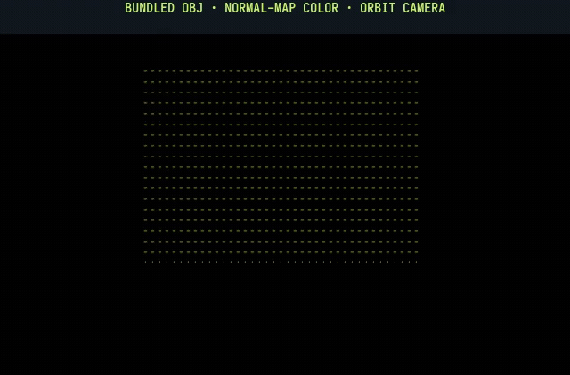
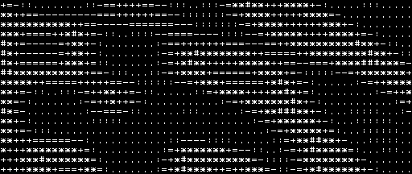
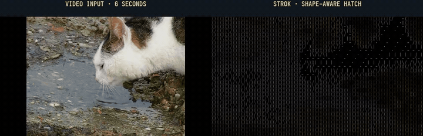

# `strok` ✒️

A structure-aware [terminal media renderer](#architecture) for local video, images, cameras, streams, terminal casts, scenes, and shaders. Rather than choosing glyphs by brightness alone, `strok` uses edges, orientation, and local shape while keeping native terminal playback paced to media and audio.

Pre-alpha: command-line interfaces, output formats, and platform support may change.

## Stack

* Core: [C++20](https://en.cppreference.com/w/cpp/20), [CMake](https://cmake.org/), [FreeType](https://freetype.org/), and in-tree rendering/terminal protocol code
* Media: [FFmpeg](https://ffmpeg.org/) 6+, [zlib](https://zlib.net/), and [miniaudio](https://miniaud.io/) for decoding, conversion, export, and playback
* GPU: optional [Metal](https://developer.apple.com/metal/) analysis on macOS and optional [Vulkan](https://www.vulkan.org/) analysis when available
* Interfaces: terminal CLI, versioned C/C++ core API, [Python bindings](bindings/python/README.md), [Rust bindings](bindings/rust/README.md), and a browser replay embed for ANSI/asciinema exports
* Tests: [CTest](https://cmake.org/cmake/help/latest/manual/ctest.1.html), C/C++ API tests, shell smoke tests, and installed Python/Rust consumer checks

## Features

* Plays local video, images, animated GIFs, image grids, asciinema casts, numeric stdin plots, OBJ scenes, camera input, direct FFmpeg URLs, and YouTube URLs through `yt-dlp`
* Reconstructs frames with luminance, structure, half-block, block, octant, sextant, and braille renderers; supports custom ramps and font-backed shape matching
* Adds painterly, hatch, stipple, flow, posterization, DoG, ETF, line-ligature, and temporal-stability passes to the render graph
* Emits ANSI text by default and can use Kitty graphics, iTerm inline images, Sixel, or hybrid text/pixel output when the terminal supports them
* Keeps audio/video in sync, handles live camera/RTSP reconnects, bounds capture backlog, and exposes profiles for live, structure, low-bandwidth, and export workflows
* Exports rasterized MP4, PNG stills, ANSI streams, asciinema casts, captions, metrics, and diagnostics

## GIF

<div align="center">
  
  <p><sub>Bundled OBJ scene with normal-map colour and an orbit camera.</sub></p>
  
  <p><sub>Bundled Shadertoy-style shader input rendered as ASCII.</sub></p>
  
  <p><sub>Six seconds of public-domain video beside its shape-aware hatch output.</sub></p>
</div>

Demo provenance and generation notes are in [docs/demo-source.md](docs/demo-source.md).

## Architecture

```text
video / image / stream / camera / cast / stdin / OBJ / GLSL
                           │
                           ▼
             FFmpeg decode · scene rasterizer · shader runtime
                           │
                           ▼
RGB frame ──► optional styles ──► luminance / edges / shape / temporal analysis
                           │
                           ▼
              CellBuffer (glyph + foreground + background per terminal cell)
                           │
                           ▼
       ANSI text · Kitty · iTerm inline images · Sixel · MP4 / PNG / ANSI / cast
```

`--graph dump --mode structure` prints the resolved render-pass graph. The public C/C++ core renders into `CellBuffer`; the CLI adds media acquisition, pacing, terminal sessions, and presentation.

## Usage

The following builds `strok` from source.

1. Clone the repository.

   ```console
   $ git clone https://github.com/gongahkia/strok && cd strok
   ```

2. Install build and media dependencies.

   ```sh
   # macOS
   brew install cmake pkg-config ffmpeg freetype zlib

   # Debian / Ubuntu
   sudo apt-get update
   sudo apt-get install -y build-essential cmake dpkg-dev file pkg-config \
     libavformat-dev libavcodec-dev libavdevice-dev libavutil-dev \
     libswscale-dev libswresample-dev libfreetype-dev zlib1g-dev
   ```

3. Configure, build, and inspect the local runtime.

   ```console
   $ cmake --preset ci
   $ cmake --build --preset ci --parallel
   $ ./build/ci/strok --doctor
   ```

4. Play a file, use the built-in scene, or start a camera session. Press `q` to quit; `space` pauses and left/right arrows seek.

   ```console
   $ ./build/ci/strok --input movie.mp4 --profile structure --fit
   $ ./build/ci/strok --input strok:scene:cube --mode luminance --scene-camera orbit
   $ ./build/ci/strok --input cam --profile live
   ```

5. Optionally run the test suite.

   ```console
   $ ctest --test-dir build/ci --output-on-failure
   ```

For a CPU-only build without optional Metal/Vulkan linkage:

```console
$ cmake -S . -B build/light -DCMAKE_BUILD_TYPE=Release -DSTROK_LIGHT=ON
$ cmake --build build/light --target strok --parallel
```

Run `strok --help` for the complete CLI surface. `--doctor` is read-only and reports the active backend, FFmpeg/device support, terminal capabilities, configuration, and shader-tool discovery.

## Support

| Platform | Support |
| --- | --- |
| macOS | ✅ CPU and Metal analysis; GLSL shader input requires `glslangValidator` and `spirv-cross` on `PATH` |
| Linux | ✅ CPU analysis and optional Vulkan; graphics-protocol support depends on the terminal |
| Windows (WSL 2) | 🧪 Experimental; cameras require USB/IP passthrough as described in [WSL camera setup](docs/wsl-camera.md) |

## Other docs

* [Dependencies and optional backends](DEPENDENCIES.md)
* [CLI manual](docs/strok.1) and [live-input acceptance](docs/live-input-acceptance.md)
* [Render aspect guidance](docs/aspect.md) and [blitter ladder](docs/blitter-ladder.md)
* [Terminal graphics proof](docs/phase-n-terminal-graphics-proof.md) and [metrics JSON Lines schema](docs/metrics-jsonl.md)
* [Python bindings](bindings/python/README.md), [Rust bindings](bindings/rust/README.md), and [`@strok/embed`](packages/strok-embed/README.md)
* [Benchmarks](BENCHMARKS.md) and [demo provenance](docs/demo-source.md)

## License

MIT.
