# kumeyuri wow demos

Run `scripts/render-demos.sh` from the repository root to regenerate the
rendered assets.

60-second screencast: [kumeyuri-screencast.cast](./kumeyuri-screencast.cast)

```bash
asciinema play demos/kumeyuri-screencast.cast
```

| Preview | Demo | Type | Source | Rendered |
| --- | --- | --- | --- | --- |
|  | HTTP request lifecycle | Sequence | [http-request-lifecycle.mmd](./http-request-lifecycle.mmd) | [SVG](./rendered/http-request-lifecycle.svg) / [GIF](./rendered/http-request-lifecycle.gif) |
|  | OAuth flow | Sequence | [oauth-flow.mmd](./oauth-flow.mmd) | [SVG](./rendered/oauth-flow.svg) / [GIF](./rendered/oauth-flow.gif) |
|  | OS scheduler state machine | State | [os-scheduler-state-machine.mmd](./os-scheduler-state-machine.mmd) | [SVG](./rendered/os-scheduler-state-machine.svg) / [GIF](./rendered/os-scheduler-state-machine.gif) |
|  | Microservice fan-out | Flowchart | [microservice-fan-out.mmd](./microservice-fan-out.mmd) | [SVG](./rendered/microservice-fan-out.svg) / [GIF](./rendered/microservice-fan-out.gif) |
|  | Sorting algorithm trace | Flowchart | [sorting-algorithm-trace.mmd](./sorting-algorithm-trace.mmd) | [SVG](./rendered/sorting-algorithm-trace.svg) / [GIF](./rendered/sorting-algorithm-trace.gif) |
