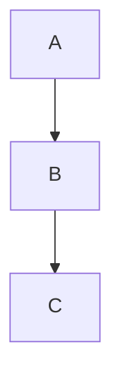

# Directives

kumeyuri reads Mermaid directive wrappers:

```mermaid
%%{ animate: 'trace', speed: 1.0, loop: false, easing: 'linear' }%%
```

Only directives whose key is `animate` affect animation. Other directives are
kept in the AST for forward compatibility and ignored by renderers.

## Fields

| Field | Values | Default |
| --- | --- | --- |
| `animate` | `trace`, `playback`, `transitions`, `none` | Diagram default |
| `speed` | finite number greater than `0.0` | `1.0` |
| `loop` | `true`, `false` | `false` |
| `easing` | `linear`, `ease` | `linear` |

The `animate` field is required inside an animation directive.

## Defaults

| Diagram | Default mode | Base frame duration |
| --- | --- | --- |
| `flowchart` / `graph` | `trace` | 550 ms |
| `sequenceDiagram` | `playback` | 700 ms |
| `stateDiagram` / `stateDiagram-v2` | `transitions` | 650 ms |

`speed` scales duration by division. A speed of `2.0` plays frames twice as
fast as the base duration.

## Mode compatibility

| Mode | Compatible diagrams |
| --- | --- |
| `trace` | Flowcharts |
| `playback` | Sequence diagrams |
| `transitions` | State diagrams |
| `none` | All supported diagrams |

An incompatible mode is a render error.

## Placement

Animation directives can appear before the diagram header or inside the diagram.
Multiple animation directives are applied in source order; the last valid
animation directive wins.



The final directive above disables animation.

## CLI overrides

`kumeyuri play` can override directive speed and loop values:

```bash
kumeyuri play diagram.mmd --speed 2 --loop
```

Render outputs use directive configuration from the source.
