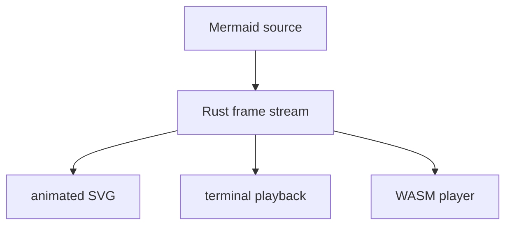

# Quickstart

Create a Mermaid file:



Render static terminal output:

```bash
kumeyuri render diagram.mmd --format text --charset unicode
```

Render an animated SVG:

```bash
kumeyuri render diagram.mmd --format svg --theme github --dark-theme tokyo-night > diagram.svg
```

Render a GIF fallback:

```bash
kumeyuri render diagram.mmd --format gif --theme github --padding 12 > diagram.gif
```

Play the diagram in the terminal:

```bash
kumeyuri play diagram.mmd --speed 1.5 --loop
```

Watch a file and redraw text output when it changes:

```bash
kumeyuri watch diagram.mmd
```

Use `cargo run -q -p kumeyuri-cli --` before each command when running from a
checkout without installing the binary.
