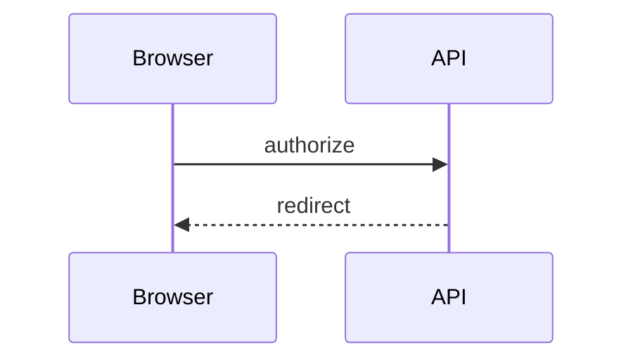

# Recipes

## README animation plus fallback

```bash
kumeyuri render diagrams/request.mmd --format svg --theme github --dark-theme tokyo-night > diagrams/request.svg
kumeyuri render diagrams/request.mmd --format gif --theme github --padding 12 > diagrams/request.gif
```

```md


Fallback:


```

## Terminal demo loop

```bash
kumeyuri play diagrams/oauth.mmd --speed 1.25 --loop
```

Useful source directive:



## One dark-aware SVG

```bash
kumeyuri render diagrams/state.mmd \
  --format svg \
  --theme github \
  --dark-theme tokyo-night \
  > diagrams/state.svg
```

The generated SVG contains a dark color-scheme rule, so consumers can keep one
asset path.

## Paired light and dark files

```bash
kumeyuri render diagrams/flow.mmd --format svg --theme github > diagrams/flow.svg
kumeyuri render diagrams/flow.mmd --format svg --theme tokyo-night > diagrams/flow.dark.svg
```

```html
<picture>
  <source srcset="/diagrams/flow.dark.svg" media="(prefers-color-scheme: dark)">
  
</picture>
```

## Static site playground

Build the browser wrapper and serve the committed site:

```bash
npm install
npm --workspace kumeyuri run build
python3 -m http.server 4174 --directory site
```

Open `http://127.0.0.1:4174/` and edit the playground source.

## CI render check

Keep Mermaid source in `diagrams/` and generated assets beside it. A simple check
can regenerate assets and fail if tracked output changes:

```bash
kumeyuri render diagrams/flow.mmd --format svg --theme github --dark-theme tokyo-night > diagrams/flow.svg
kumeyuri render diagrams/flow.mmd --format gif --theme github --padding 12 > diagrams/flow.gif
git diff --exit-code -- diagrams/flow.svg diagrams/flow.gif
```
