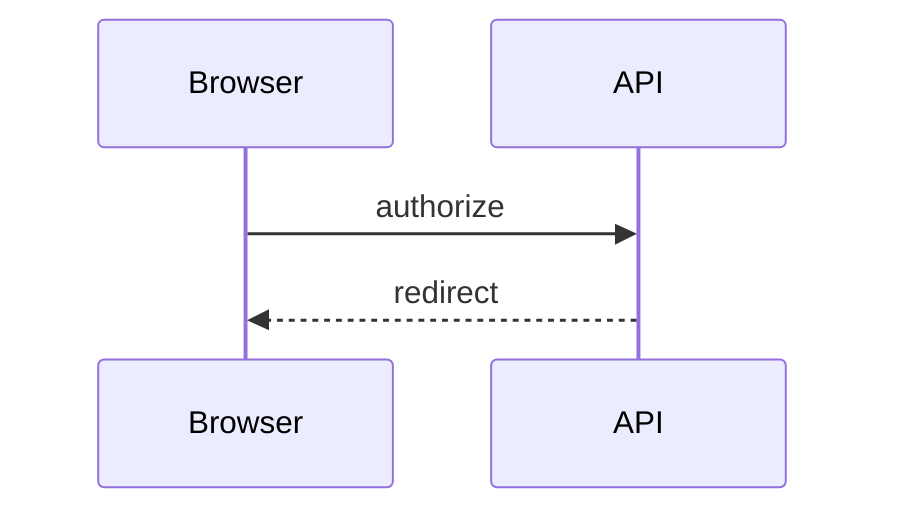

# Recipes

## README animation plus fallback

```bash
kumeyuri render diagrams/request.mmd --format svg --theme github --dark-theme tokyo-night > diagrams/request.svg
kumeyuri render diagrams/request.mmd --format gif --theme github --padding 12 > diagrams/request.gif
```

```md


Fallback:


```

## Terminal demo loop

```bash
kumeyuri play diagrams/oauth.mmd --speed 1.25 --loop
```

Useful source directive:



## One dark-aware SVG

```bash
kumeyuri render diagrams/state.mmd \
  --format svg \
  --theme github \
  --dark-theme tokyo-night \
  > diagrams/state.svg
```

The generated SVG contains a dark color-scheme rule, so consumers can keep one
asset path.

## Paired light and dark files

```bash
kumeyuri render diagrams/flow.mmd --format svg --theme github > diagrams/flow.svg
kumeyuri render diagrams/flow.mmd --format svg --theme tokyo-night > diagrams/flow.dark.svg
```

```html
<picture>
  <source srcset="/diagrams/flow.dark.svg" media="(prefers-color-scheme: dark)">
  
</picture>
```

## Static site playground

Build the browser wrapper and serve the committed site:

```bash
npm install
npm --workspace kumeyuri run build
python3 -m http.server 4174 --directory site
```

Open `http://127.0.0.1:4174/` and edit the playground source.

## CI render check

Keep Mermaid source in `diagrams/` and generated assets beside it. A simple check
can regenerate assets and fail if tracked output changes:

```bash
kumeyuri render diagrams/flow.mmd --format svg --theme github --dark-theme tokyo-night > diagrams/flow.svg
kumeyuri render diagrams/flow.mmd --format gif --theme github --padding 12 > diagrams/flow.gif
git diff --exit-code -- diagrams/flow.svg diagrams/flow.gif
```

## Render plain terminal text

```bash
kumeyuri render examples/ci-pipeline.mmd --format text --charset ascii
```

Use `--charset unicode` when the target terminal supports box drawing and arrow
glyphs.

## Render a fixed-width terminal snapshot

```bash
kumeyuri render examples/order-lifecycle.mmd --format text --width 96 > order-lifecycle.txt
```

Pinning width makes docs diffs easier to review.

## Keep long labels readable

```bash
kumeyuri render examples/incident-response.mmd --format text --max-label-width 18
```

Use this for dense flowcharts where one long label stretches the whole layout.

## Watch a diagram while editing

```bash
kumeyuri watch examples/cache-refresh.mmd
```

The command redraws text output after each file save.

## Watch with a local theme file

```bash
kumeyuri watch examples/cache-refresh.mmd --theme-file themes/local.kumetheme.toml
```

The theme file is reloaded on each redraw, which keeps color tweaks fast.

## Validate layout warnings before commit

```bash
kumeyuri lint examples/ci-pipeline.mmd
```

Use this when generated assets should not change unless warnings are understood.

## Emit machine-readable lint output

```bash
kumeyuri lint examples/ci-pipeline.mmd --json > target/ci-pipeline.lint.json
```

JSON output is stable enough for CI checks and review artifacts.

## Check Mermaid root compatibility

```bash
kumeyuri compat
```

This prints supported roots, static-only roots, unsupported roots, and common
caveats for the tracked Mermaid version.

## Label an unverified Mermaid version check

```bash
kumeyuri compat --mermaid-version 11.15.0
```

If the requested version differs from the local coverage matrix, the output is
labelled as unverified.

## Export a portable kumecast

```bash
kumeyuri export examples/oauth-login.mmd --format kumecast > oauth-login.kumecast
```

Use `.kumecast` when a downstream tool should replay frames without reparsing
Mermaid source.

## Export a compressed kumecast

```bash
kumeyuri export examples/oauth-login.mmd --format kumecast-gz > oauth-login.kumecast.gz
```

Compressed casts are better for checked-in fixtures and hosted downloads.

## Convert a kumecast to SVG

```bash
kumeyuri convert oauth-login.kumecast --format svg > oauth-login.svg
```

This keeps render-time options fixed at export time.

## Convert a compressed kumecast to GIF

```bash
kumeyuri convert oauth-login.kumecast.gz --format gif > oauth-login.gif
```

Use this for release artifacts generated from a reviewed cast.

## Inspect kumecast text frames

```bash
kumeyuri convert oauth-login.kumecast --format text
```

Text conversion prints each frame with its duration header.

## Play a kumecast in the terminal

```bash
kumeyuri play oauth-login.kumecast --loop
```

Cast playback skips source parsing and uses the stored timeline.

## Build an APNG for docs

```bash
kumeyuri render examples/payment-retry.mmd --format apng --padding 12 > payment-retry.png
```

APNG works well when GIF color limits are too visible.

## Build an animated WebP

```bash
kumeyuri render examples/payment-retry.mmd --format webp --padding 12 > payment-retry.webp
```

Use WebP for sites where browser support and file size matter more than broad
Markdown compatibility.

## Render high-contrast docs assets

```bash
kumeyuri render examples/incident-response.mmd --format svg --theme high-contrast > incident-response.svg
```

This is useful for accessibility review pages and printouts.

## Render print-friendly monochrome

```bash
kumeyuri render examples/incident-response.mmd --format svg --theme print-mono > incident-response-print.svg
```

Use a dedicated print file instead of relying on browser color transforms.

## Show available themes

```bash
kumeyuri theme list
```

Theme discovery checks project, XDG, and bundled themes in order.

## Inspect a bundled theme

```bash
kumeyuri theme show tokyo-night
```

The command prints canonical `.kumetheme.toml`.

## Create a new theme file

```bash
kumeyuri theme new themes/team.kumetheme.toml --name team
```

Start from generated TOML, then validate before using it in CI.

## Validate a custom theme

```bash
kumeyuri theme validate themes/team.kumetheme.toml
```

Validation fails before a bad theme reaches render jobs.

## Publish a static theme index

```bash
kumeyuri theme publish themes/team.kumetheme.toml --index-dir public --base-url https://themes.example.dev
```

This writes canonical theme TOML and updates an `index.json` suitable for static
hosting.

## Render every example to SVG

```bash
for file in examples/*.mmd; do
  name="$(basename "$file" .mmd)"
  kumeyuri render "$file" --format svg --theme github --dark-theme tokyo-night > "examples/rendered/$name.svg"
done
```

Run this after parser or renderer changes that affect the gallery.

## Render every example to GIF

```bash
for file in examples/*.mmd; do
  name="$(basename "$file" .mmd)"
  kumeyuri render "$file" --format gif --theme github --padding 12 > "examples/rendered/$name.gif"
done
```

Review GIF size before committing large gallery refreshes.

## Fail CI on stale generated gallery assets

```bash
for file in examples/*.mmd; do
  name="$(basename "$file" .mmd)"
  kumeyuri render "$file" --format svg --theme github --dark-theme tokyo-night > "examples/rendered/$name.svg"
done
git diff --exit-code -- examples/rendered
```

This catches changed renderer output without requiring image inspection in every
PR.

## Embed an inline live diagram

```html
<kumeyuri-diagram
  inline="graph TD&#10;A --> B"
  animate="trace"
  theme="github"
  controls
></kumeyuri-diagram>
```

Use inline source for small examples where another fetch would be unnecessary.

## Embed a live diagram from source

```html
<kumeyuri-diagram
  src="/diagrams/checkout.mmd"
  animate="trace"
  theme="github"
  dark-theme="tokyo-night"
  autoplay
  controls
></kumeyuri-diagram>
```

Use `src` when source should stay editable and reviewable beside docs.

## Add a mdBook preprocessor render path

```toml
[preprocessor.kumeyuri]
command = "mdbook-kumeyuri"
format = "svg"
replace = false
theme = "github"
```

Keep `replace = false` when readers should still see source fences.

## Render for a Hugo shortcode

```bash
kumeyuri render content/diagrams/flow.mmd --format svg --theme github > static/diagrams/flow.svg
```

```md

```

Generate assets under `static/` so Hugo serves them unchanged.

## Render for Docusaurus MDX

```bash
kumeyuri render docs/diagrams/flow.mmd --format svg --theme github > static/diagrams/flow.svg
```

```mdx

```

Use the live plugin only when the page needs runtime controls.

## Use animation directives for static renders


This keeps generated SVG/GIF output static even when the diagram type has an
animated default.

## Override playback speed for a demo

```bash
kumeyuri play examples/websocket-session.mmd --speed 1.5 --loop
```

Use CLI speed overrides for demos instead of editing source directives.

## Run the optional AI layout binding

```bash
KUMEYURI_AI_DYLIB=target/release/libkumeyuri_ai.dylib kumeyuri layout --ai examples/ci-pipeline.mmd
```

The main CLI checks the ABI symbol before applying any AI-provided rewrite.

## Limit input size in automation

```bash
kumeyuri --max-input-bytes 262144 render diagrams/flow.mmd --format svg > diagrams/flow.svg
```

Set a tighter limit for hosted or bot-driven render paths.

## Render plugin-enabled output

```bash
kumeyuri render diagrams/plugin-demo.mmd --format svg --plugin-allow fs.read,cache.read > plugin-demo.svg
```

Only grant plugin capabilities needed by the render path.

## Allow plugin network fetches explicitly

```bash
kumeyuri render diagrams/plugin-demo.mmd --format svg --allow-external --plugin-allow net.fetch,cache.write > plugin-demo.svg
```

Network fetches require both `--allow-external` and the matching plugin
capability.
