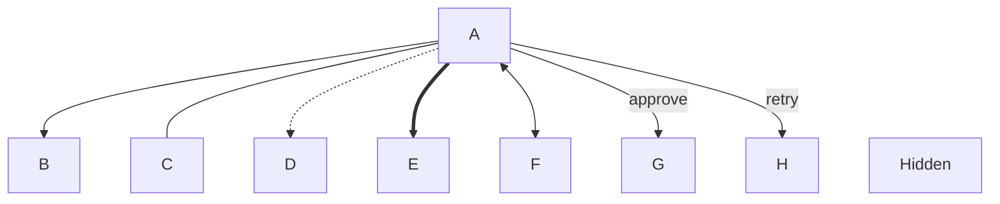
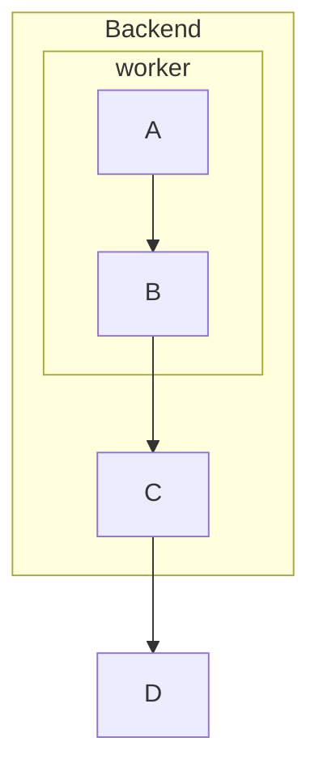
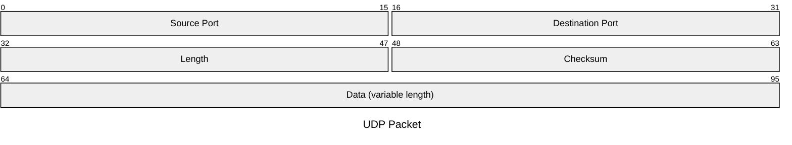
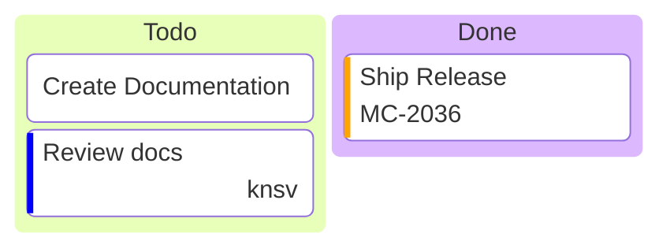
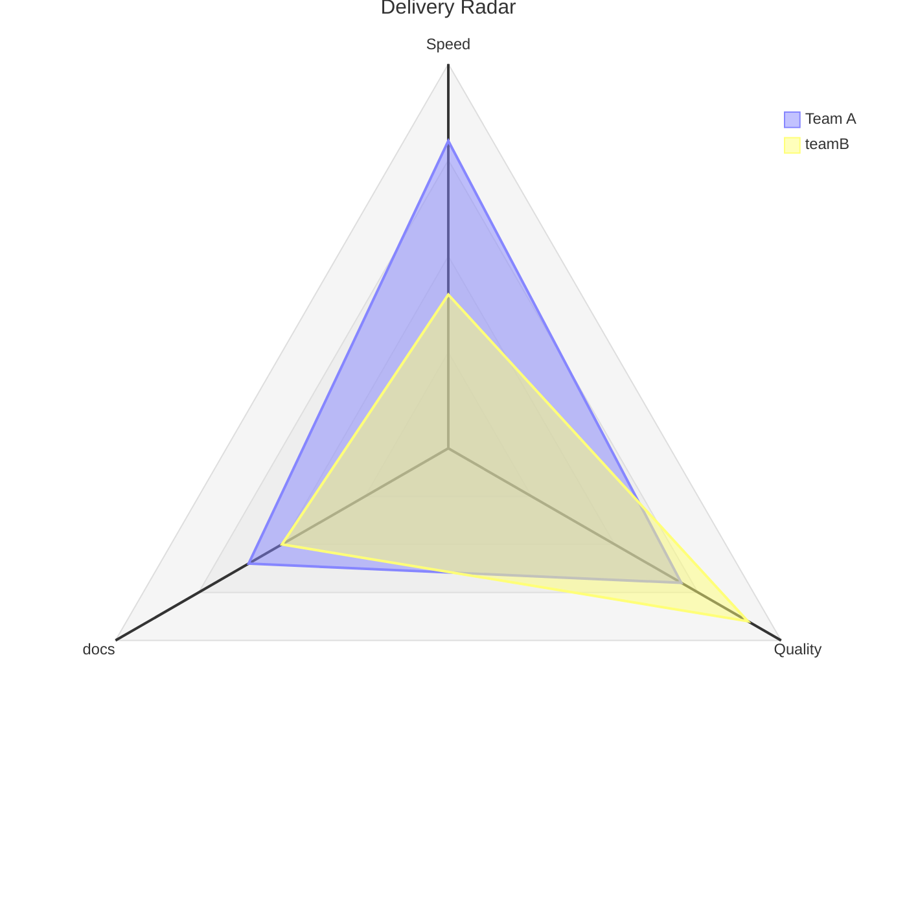
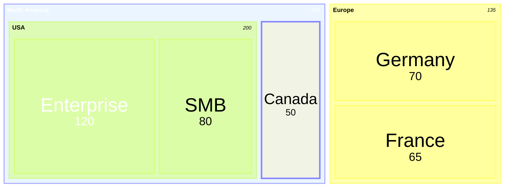

# Syntax

kumeyuri accepts a focused Mermaid subset for animated rendering. This page
documents the accepted forms in the current parser.

## Common

Blank lines are ignored. Mermaid comments are accepted:

```mermaid
%% keep this note in source
```

Directives use the Mermaid directive wrapper:

```mermaid
%%{ animate: 'trace', speed: 1.25 }%%
```

Unknown non-animation directives are preserved in the AST but do not change
rendering.

## Flowcharts

Headers:

```mermaid
graph TD
flowchart LR
```

Directions: `TD`, `TB`, `BT`, `LR`, `RL`.

Node ids start with an ASCII letter, digit, or `_`, then may contain ASCII
letters, digits, `_`, or `-`.

| Shape | Example |
| --- | --- |
| Rectangle | `A[Start]` |
| Round | `A(Start)` |
| Stadium | `A([Ready])` |
| Subroutine | `A[[Work]]` |
| Cylinder | `A[(Database)]` |
| Circle | `A((End))` |
| Double circle | `A(((Done)))` |
| Asymmetric | `A>Event]` |
| Rhombus | `A{Choice}` |
| Hexagon | `A{{Gate}}` |
| Parallelogram | `A[/Input/]` |
| Parallelogram alt | `A[\Output\]` |
| Trapezoid | `A[/Manual\]` |
| Trapezoid alt | `A[\Manual/]` |
| Named shape | `A@{ shape: notch-rect }` |

Edges:



Arrow heads can appear at the start or end where Mermaid uses them: `>`, `<`,
`o`, and `x` are accepted by the edge operator parser.

Subgraphs can nest:



Flowchart class declarations:


## Block diagrams

Header:

```mermaid
block
block columns 3
```

Blocks are placed in source order. `columns n` changes wrapping for following
items. Node syntax uses the classic flowchart shapes, plus Mermaid block widths,
spaces, nested blocks, block arrows, links, and style/class declarations:

```mermaid
block columns 3
  Frontend
  right<["HTTP"]>(right)
  Backend:2

  block:Storage:2 columns 1
    Cache[(Cache)]
    DB[(Database)]
  end

  Frontend -- "calls" --> Backend
  Backend --> DB
  space:2
  classDef hot fill:#f96
  class Frontend hot
  style Backend fill:#969,stroke:#333
```

Supported block-arrow directions are `left`, `right`, `up`, `down`, `x`, and
`y`. CSS styles and classes are parsed and stored but are not mapped to terminal
colors yet.

## Packet diagrams

Header:


Fields use explicit bit positions or a `+count` shorthand that starts after the
previous field:



Single-bit fields are accepted with `106: "URG"`. Ranges where the end bit is
less than the start bit are rejected. Packet rendering is a fixed 32-bit row
table; Mermaid packet config fields are not interpreted yet.

## Kanban diagrams

Header:

```mermaid
kanban
```

Columns and tasks are indentation based:



Column and task labels can be `id[label]`, `[label]`, or bare labels. Task
metadata supports key/value rows inside `@{ ... }`; values may be bare,
single-quoted, or double-quoted. Mermaid frontmatter config such as
`ticketBaseUrl` is not interpreted yet.

## Architecture diagrams

Header:

```mermaid
architecture-beta
```

Groups, services, junctions, edges, and alignment statements are accepted:


Services and groups accept optional icon text in parentheses and titles in
square brackets. Edges use side endpoints `T`, `B`, `L`, and `R`, plus `--`,
`-->`, `<--`, or `<-->`. Mermaid icon pack registration and ELK/fcose layout
config are not interpreted yet.

## Radar diagrams

Header:


Axes, curves, and options:



Curve values may be positional or keyed with `axis: value`. `showLegend`,
`max`, `min`, `graticule`, and `ticks` are parsed. Mermaid radar dimensions,
theme variables, color scales, and curve tension are not interpreted yet.

## Event Modeling diagrams

Header:

```mermaid
eventmodeling
```

Timeframes, reset frames, data refs, inline data, data blocks, and explicit
relations:


Entity aliases `ui`, `pcr`/`processor`, `cmd`/`command`,
`rmo`/`readmodel`, and `evt`/`event` are parsed. Namespaces are rendered as
swimlane groups. Mermaid Event Modeling `padding` and `rowHeight` config are
not interpreted yet.

## Treemap diagrams

Header:

```mermaid
treemap-beta
```

Quoted parent nodes, numeric leaf values, hierarchy by indentation, and inline
classes:



Values must be non-negative numbers. `classDef` and inline classes are retained
semantically, but Mermaid treemap padding, node size, border/font settings,
`showValues`, `valueFormat`, and theme color mapping are not interpreted yet.

## Venn diagrams

Header:

```mermaid
venn-beta
```

Sets, unions, labels, sizes, text entries, and style statements:

```mermaid
venn-beta
title "Team overlap"
set A["Alpha"]:20
text A1["React"]
set B["Beta"]:12
union A,B["AB"]:3
text AB1["OpenAPI"]
style A fill:#ff6b6b
style A,B color:#333
```

Set and union sizes must be non-negative numbers. `style` statements are
retained and rendered as text rows, but Mermaid Venn proportional areas, color
fills, opacity, and stroke styling are not interpreted yet.

## Ishikawa diagrams

Header:

```mermaid
ishikawa-beta
```

The first body line is the problem/event. Later lines are causes nested by
indentation:

```mermaid
ishikawa-beta
Blurry Photo
  Process
    Out of focus
    Shutter speed too slow
  User
    Shaky hands
  Equipment
    Dirty lens
```

The renderer uses a fixed fishbone layout with an event head, spine, alternating
root cause branches, and recursive cause boxes. Mermaid styling and future
Ishikawa-specific config are not interpreted yet.

## Sequence diagrams

Header:

```mermaid
sequenceDiagram
```

Participants:

```mermaid
participant Alice as Alice Doe
actor Bob
```

Messages:

```mermaid
Alice->Bob: solid line
Alice-->Bob: dotted line
Alice->>Bob: solid arrow
Alice-->>Bob: dotted arrow
Alice-xBob: cross
Alice--)Bob: open
Alice<<->>Bob: bidirectional
```

Notes:

```mermaid
Note over Alice,Bob: Shared state
Note left of Alice: Local cache
Note right of Bob: Remote API
```

Control blocks:

```mermaid
loop Retry
  Alice->>Bob: try
end

alt Success
  Bob-->>Alice: ok
end

opt Cache hit
  Alice->>Bob: use cache
end

par Worker A
  Alice->>Bob: task
end
```

## State diagrams

Headers:

```mermaid
stateDiagram
stateDiagram-v2
```

Directions:

```mermaid
direction LR
```

States and transitions:

```mermaid
stateDiagram-v2
  [*] --> Idle
  state "Power On" as power_on
  Idle --> Running: start
  Running --> Idle: stop
```

Special state tags:

```mermaid
state decision <<choice>>
state fork <<fork>>
state join <<join>>
state done <<end>>
```

Composite states:

```mermaid
stateDiagram-v2
  state Composite {
    Idle --> Running
  }
  Composite --> Done
```
