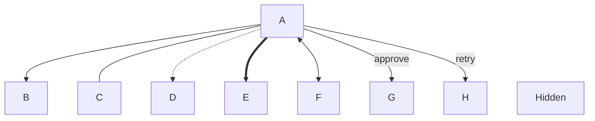
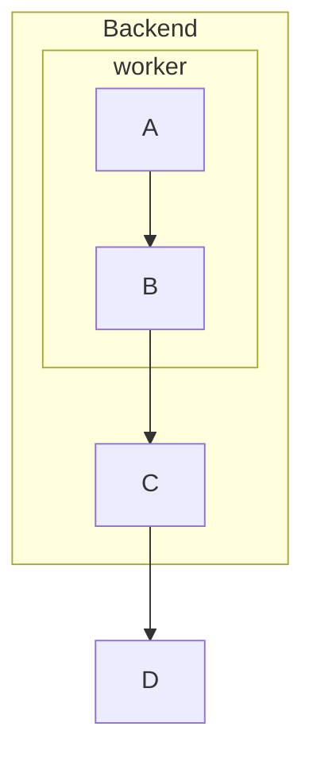
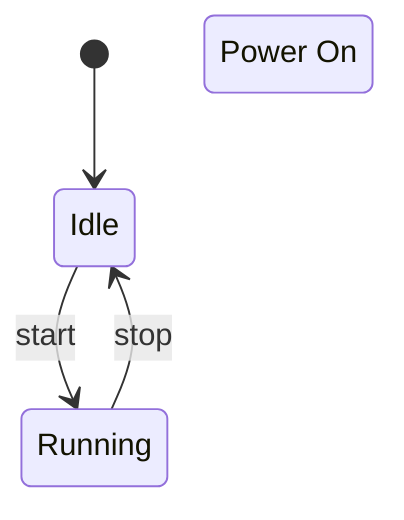
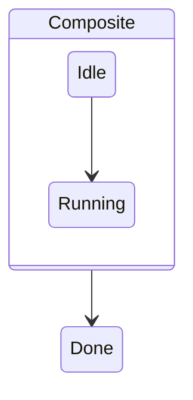

# Syntax

kumeyuri accepts a focused Mermaid subset for animated rendering. This page
documents the accepted forms in the current parser.

## Common

Blank lines are ignored. Mermaid comments are accepted:

```mermaid
%% keep this note in source
```

Directives use the Mermaid directive wrapper:

```mermaid
%%{ animate: 'trace', speed: 1.25 }%%
```

Unknown non-animation directives are preserved in the AST but do not change
rendering.

## Flowcharts

Headers:

```mermaid
graph TD
flowchart LR
```

Directions: `TD`, `TB`, `BT`, `LR`, `RL`.

Node ids start with an ASCII letter, digit, or `_`, then may contain ASCII
letters, digits, `_`, or `-`.

| Shape | Example |
| --- | --- |
| Rectangle | `A[Start]` |
| Round | `A(Start)` |
| Stadium | `A([Ready])` |
| Subroutine | `A[[Work]]` |
| Cylinder | `A[(Database)]` |
| Circle | `A((End))` |
| Double circle | `A(((Done)))` |
| Asymmetric | `A>Event]` |
| Rhombus | `A{Choice}` |
| Hexagon | `A{{Gate}}` |
| Parallelogram | `A[/Input/]` |
| Parallelogram alt | `A[\Output\]` |
| Trapezoid | `A[/Manual\]` |
| Trapezoid alt | `A[\Manual/]` |
| Named shape | `A@{ shape: notch-rect }` |

Edges:



Arrow heads can appear at the start or end where Mermaid uses them: `>`, `<`,
`o`, and `x` are accepted by the edge operator parser.

Subgraphs can nest:



Flowchart class declarations:


## Sequence diagrams

Header:

```mermaid
sequenceDiagram
```

Participants:

```mermaid
participant Alice as Alice Doe
actor Bob
```

Messages:

```mermaid
Alice->Bob: solid line
Alice-->Bob: dotted line
Alice->>Bob: solid arrow
Alice-->>Bob: dotted arrow
Alice-xBob: cross
Alice--)Bob: open
Alice<<->>Bob: bidirectional
```

Notes:

```mermaid
Note over Alice,Bob: Shared state
Note left of Alice: Local cache
Note right of Bob: Remote API
```

Control blocks:

```mermaid
loop Retry
  Alice->>Bob: try
end

alt Success
  Bob-->>Alice: ok
end

opt Cache hit
  Alice->>Bob: use cache
end

par Worker A
  Alice->>Bob: task
end
```

## State diagrams

Headers:

```mermaid
stateDiagram
stateDiagram-v2
```

Directions:

```mermaid
direction LR
```

States and transitions:



Special state tags:

```mermaid
state decision <<choice>>
state fork <<fork>>
state join <<join>>
state done <<end>>
```

Composite states:


