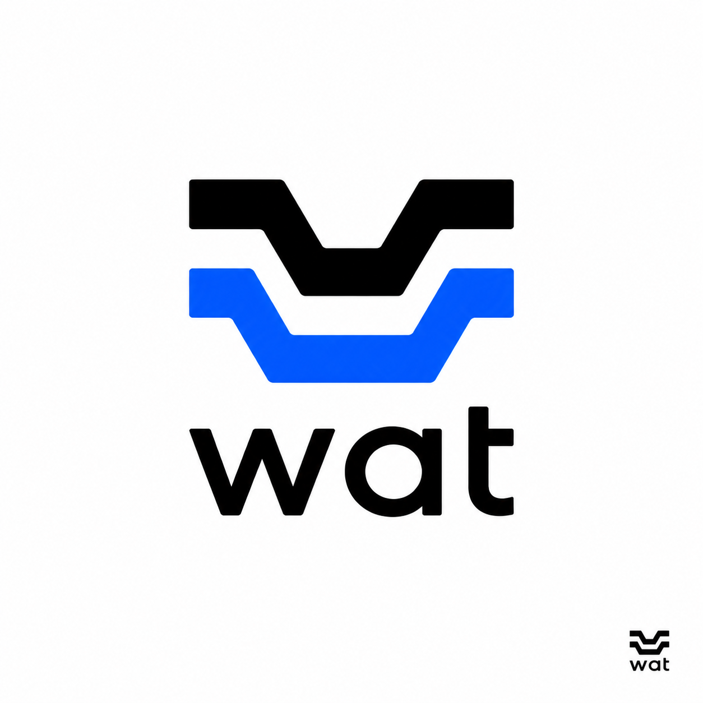
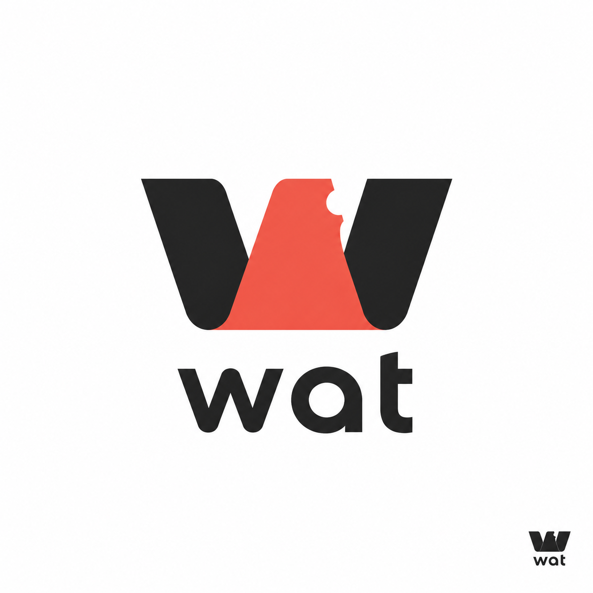
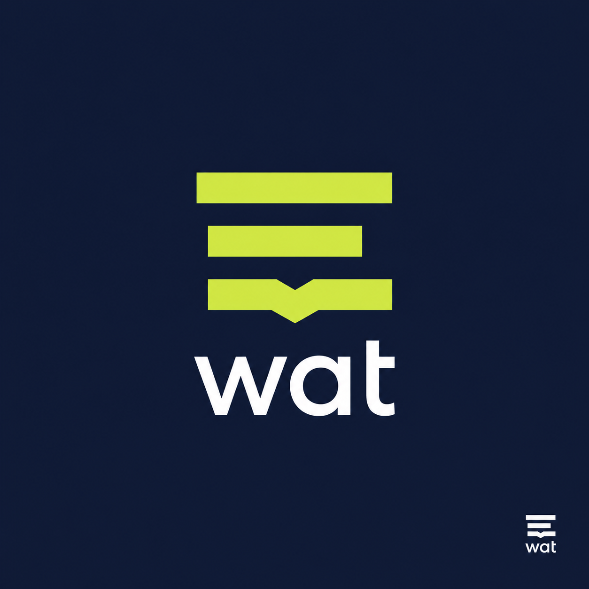

# wat logo directions

Three original directions for `wat`: an acronym tracker that turns shorthand into clear, shared context. Preview artwork was generated for this exploration; the construction specifications below are the source-of-truth vector brief.

## 1. Signal Split

Two offset, open `W` strokes create a before/after reading: a dense signal becomes an understood signal. The nested geometry also reads as a compact context layer without a globe or chat-bubble cliché.

- palette: graphite `#111111`, signal blue `#315CFF`, white `#FFFFFF`
- type: lowercase geometric sans; use `Inter Tight` 700 or `Manrope` 800; set `wat` at 92% tracking
- monochrome: use a single fill; preserve the negative gap between strokes
- construction: 64×64 viewBox; each stroke is a 12-unit-wide rounded polygon. Top stroke points: `(8,14) (24,14) (32,34) (40,34) (48,14) (64,14) (48,46) (16,46)`. Bottom stroke is the same polygon translated `y=16`; delete its central 16-unit top span so the two forms remain visibly separate. Use `stroke-linejoin="round"` or 4-unit corner radii.
- 16 px: retain only the two strokes, at 3 px width with a 2 px gap; do not include the wordmark

## 2. Fold Key

A folded lowercase `w` becomes an access key: a deliberate notch signals the exact moment an abbreviation unlocks its meaning. It is warmer and more editorial than the other directions.

- palette: ink `#202124`, coral `#F15A4A`, white `#FFFFFF`
- type: lowercase geometric sans; use `Sora` 700 or `Avenir Next` Demi Bold; no custom ligature needed
- monochrome: merge the three fills into one `w`; retain the notch as a white cutout
- construction: 64×64 viewBox. Left and right wings are mirrored 16-unit-wide quadrilateral strokes: left `(6,12) (22,12) (31,46) (23,46)`; right mirror around `x=32`. Centre fold is `(22,12) (42,12) (49,46) (31,46)`. Cut a 5-unit semicircle from the upper-right centre edge using `fill-rule="evenodd"`; it must face outwards.
- 16 px: simplify the notch to a 2 px square cutout, retain the three-part silhouette

## 3. Context Window

Three text-width bars resolve into a compact open `W`. It treats jargon as fragments whose arrangement makes context legible, while avoiding literal messaging imagery.

- palette: midnight `#17233F`, clarity lime `#C9F04A`, white `#FFFFFF`
- type: lowercase grotesk; use `Space Grotesk` 700 or `IBM Plex Sans` 700; white wordmark on midnight only
- monochrome: all bars use one fill; retain the lower bar’s centre chevron as negative space
- construction: 64×64 viewBox. Bars are 44×7 rounded rectangles at `(10,12)`, `(14,26)`, and `(14,40)`. On the lower bar, subtract a centred down-chevron with points `(27,40) (32,45) (37,40) (37,47) (32,52) (27,47)`, then trim the outer lower corners to 2-unit radii.
- 16 px: use three 11×2 px bars; encode the chevron as a single 2 px centre dip

## Usage and selection

All three marks avoid third-party platform branding, generic globes, and generic chat bubbles. For an app icon, use the symbol alone with a 12.5% quiet area. For README and social previews, use the symbol plus lowercase wordmark on an uncluttered field. Direction 1 is the strongest default for the product because its duplicated stroke directly expresses decoding while surviving at 16 px.
