# Static Parity Comparison

<!-- generated by scripts/generate-static-comparison.sh; do not edit by hand -->

This page renders the same Mermaid input through Kumeyuri and compares it with vendored reference outputs from `beautiful-mermaid` and `mermaid-ascii`.

## `single_node`

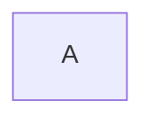

<table>
<thead><tr><th>Kumeyuri</th><th>beautiful-mermaid</th><th>mermaid-ascii</th></tr></thead>
<tbody><tr>
<td><pre><code>+---+
|   |
| A |
|   |
+---+
</code></pre></td>
<td><pre><code>+---+
|   |
| A |
|   |
+---+
</code></pre></td>
<td><pre><code>+---+
|   |
| A |
|   |
+---+
</code></pre></td>
</tr></tbody>
</table>

## `single_node_longer_name`

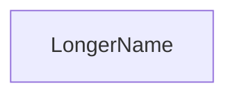

<table>
<thead><tr><th>Kumeyuri</th><th>beautiful-mermaid</th><th>mermaid-ascii</th></tr></thead>
<tbody><tr>
<td><pre><code>+------------+
|            |
| LongerName |
|            |
+------------+
</code></pre></td>
<td><pre><code>+------------+
|            |
| LongerName |
|            |
+------------+
</code></pre></td>
<td><pre><code>+------------+
|            |
| LongerName |
|            |
+------------+
</code></pre></td>
</tr></tbody>
</table>

## `two_nodes_linked`

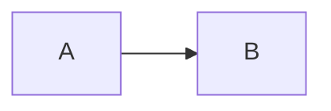

<table>
<thead><tr><th>Kumeyuri</th><th>beautiful-mermaid</th><th>mermaid-ascii</th></tr></thead>
<tbody><tr>
<td><pre><code>+---+     +---+
|   |     |   |
| A |----&gt;| B |
|   |     |   |
+---+     +---+
</code></pre></td>
<td><pre><code>+---+     +---+
|   |     |   |
| A |----&gt;| B |
|   |     |   |
+---+     +---+
</code></pre></td>
<td><pre><code>+---+     +---+
|   |     |   |
| A |----&gt;| B |
|   |     |   |
+---+     +---+
</code></pre></td>
</tr></tbody>
</table>

## `two_nodes_longer_names`

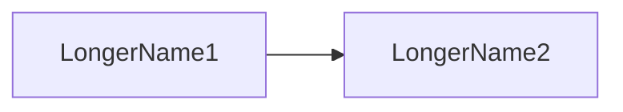

<table>
<thead><tr><th>Kumeyuri</th><th>beautiful-mermaid</th><th>mermaid-ascii</th></tr></thead>
<tbody><tr>
<td><pre><code>+-------------+     +-------------+
|             |     |             |
| LongerName1 |----&gt;| LongerName2 |
|             |     |             |
+-------------+     +-------------+
</code></pre></td>
<td><pre><code>+-------------+     +-------------+
|             |     |             |
| LongerName1 |----&gt;| LongerName2 |
|             |     |             |
+-------------+     +-------------+
</code></pre></td>
<td><pre><code>+-------------+     +-------------+
|             |     |             |
| LongerName1 |----&gt;| LongerName2 |
|             |     |             |
+-------------+     +-------------+
</code></pre></td>
</tr></tbody>
</table>

## `three_nodes`

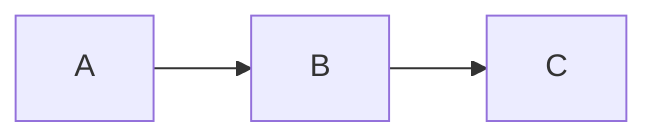

<table>
<thead><tr><th>Kumeyuri</th><th>beautiful-mermaid</th><th>mermaid-ascii</th></tr></thead>
<tbody><tr>
<td><pre><code>+---+     +---+     +---+
|   |     |   |     |   |
| A |----&gt;| B |----&gt;| C |
|   |     |   |     |   |
+---+     +---+     +---+
</code></pre></td>
<td><pre><code>+---+     +---+     +---+
|   |     |   |     |   |
| A |----&gt;| B |----&gt;| C |
|   |     |   |     |   |
+---+     +---+     +---+
</code></pre></td>
<td><pre><code>+---+     +---+     +---+
|   |     |   |     |   |
| A |----&gt;| B |----&gt;| C |
|   |     |   |     |   |
+---+     +---+     +---+
</code></pre></td>
</tr></tbody>
</table>

## `three_nodes_single_line`

<table>
<thead><tr><th>Kumeyuri</th><th>beautiful-mermaid</th><th>mermaid-ascii</th></tr></thead>
<tbody><tr>
<td><pre><code>+---+     +---+     +---+
|   |     |   |     |   |
| A |----&gt;| B |----&gt;| C |
|   |     |   |     |   |
+---+     +---+     +---+
</code></pre></td>
<td><pre><code>+---+     +---+     +---+
|   |     |   |     |   |
| A |----&gt;| B |----&gt;| C |
|   |     |   |     |   |
+---+     +---+     +---+
</code></pre></td>
<td><pre><code>+---+     +---+     +---+
|   |     |   |     |   |
| A |----&gt;| B |----&gt;| C |
|   |     |   |     |   |
+---+     +---+     +---+
</code></pre></td>
</tr></tbody>
</table>

## `two_layer_single_graph`

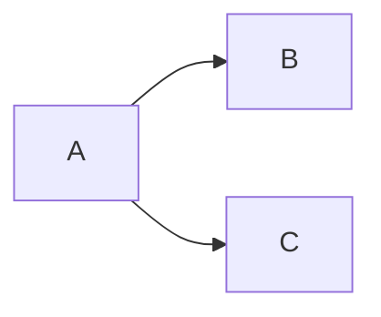

<table>
<thead><tr><th>Kumeyuri</th><th>beautiful-mermaid</th><th>mermaid-ascii</th></tr></thead>
<tbody><tr>
<td><pre><code>+---+     +---+
|   |     |   |
| A |----&gt;| B |
|   |     |   |
+---+     +---+
  |
  |
  |
  |
  |
  |       +---+
  |       |   |
  +------&gt;| C |
          |   |
          +---+
</code></pre></td>
<td><pre><code>+---+     +---+
|   |     |   |
| A |----&gt;| B |
|   |     |   |
+---+     +---+
  |            
  |            
  |            
  |            
  |            
  |       +---+
  |       |   |
  +------&gt;| C |
          |   |
          +---+
</code></pre></td>
<td><pre><code>+---+     +---+
|   |     |   |
| A |----&gt;| B |
|   |     |   |
+---+     +---+
  |            
  |            
  |            
  |            
  |            
  |       +---+
  |       |   |
  +------&gt;| C |
          |   |
          +---+
</code></pre></td>
</tr></tbody>
</table>

## `graph_tb_direction`

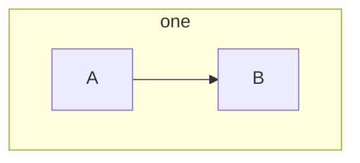

<table>
<thead><tr><th>Kumeyuri</th><th>beautiful-mermaid</th><th>mermaid-ascii</th></tr></thead>
<tbody><tr>
<td><pre><code>+-------+
|  one  |
|       |
|       |
| +---+ |
| |   | |
| | A | |
| |   | |
| +---+ |
|   |   |
|   |   |
|   |   |
|   |   |
|   v   |
| +---+ |
| |   | |
| | B | |
| |   | |
| +---+ |
|       |
+-------+
</code></pre></td>
<td><pre><code>+-------+
|  one  |
|       |
|       |
| +---+ |
| |   | |
| | A | |
| |   | |
| +---+ |
|   |   |
|   |   |
|   |   |
|   |   |
|   v   |
| +---+ |
| |   | |
| | B | |
| |   | |
| +---+ |
|       |
+-------+
</code></pre></td>
<td><pre><code>+-------+
|  one  |
|       |
|       |
| +---+ |
| |   | |
| | A | |
| |   | |
| +---+ |
|   |   |
|   |   |
|   |   |
|   |   |
|   v   |
| +---+ |
| |   | |
| | B | |
| |   | |
| +---+ |
|       |
+-------+
</code></pre></td>
</tr></tbody>
</table>

## `flowchart_tb_simple`

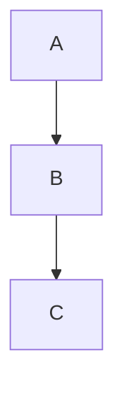

<table>
<thead><tr><th>Kumeyuri</th><th>beautiful-mermaid</th><th>mermaid-ascii</th></tr></thead>
<tbody><tr>
<td><pre><code>+---+
|   |
| A |
|   |
+---+
  |
  |
  |
  |
  v
+---+
|   |
| B |
|   |
+---+
  |
  |
  |
  |
  v
+---+
|   |
| C |
|   |
+---+
</code></pre></td>
<td><pre><code>+---+
|   |
| A |
|   |
+---+
  |  
  |  
  |  
  |  
  v  
+---+
|   |
| B |
|   |
+---+
  |  
  |  
  |  
  |  
  v  
+---+
|   |
| C |
|   |
+---+
</code></pre></td>
<td><pre><code>+---+
|   |
| A |
|   |
+---+
  |  
  |  
  |  
  |  
  v  
+---+
|   |
| B |
|   |
+---+
  |  
  |  
  |  
  |  
  v  
+---+
|   |
| C |
|   |
+---+
</code></pre></td>
</tr></tbody>
</table>

## `comments`

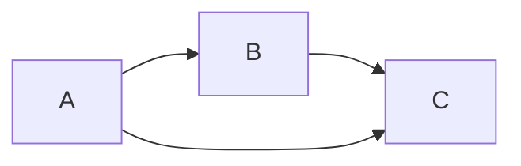

<table>
<thead><tr><th>Kumeyuri</th><th>beautiful-mermaid</th><th>mermaid-ascii</th></tr></thead>
<tbody><tr>
<td><pre><code>+---+     +---+     +---+
|   |     |   |     |   |
| A |-----|-B-|----&gt;| C |
|   |     |   |     |   |
+---+     +---+     +---+
</code></pre></td>
<td><pre><code>+---+     +---+
|   |     |   |
| A |----&gt;| B |
|   |     |   |
+---+     +---+
  |         |  
  |         |  
  |         |  
  |         |  
  |         v  
  |       +---+
  |       |   |
  +------&gt;| C |
          |   |
          +---+
</code></pre></td>
<td><pre><code>+---+     +---+
|   |     |   |
| A |----&gt;| B |
|   |     |   |
+---+     +---+
  |         |  
  |         |  
  |         |  
  |         |  
  |         v  
  |       +---+
  |       |   |
  +------&gt;| C |
          |   |
          +---+
</code></pre></td>
</tr></tbody>
</table>

## `back_reference_from_child`

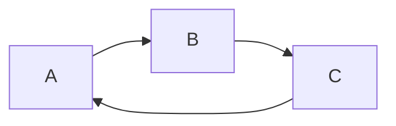

<table>
<thead><tr><th>Kumeyuri</th><th>beautiful-mermaid</th><th>mermaid-ascii</th></tr></thead>
<tbody><tr>
<td><pre><code>+---+     +---+     +---+
|   |     |   |     |   |
| A |----&gt;| B |----&gt;| C |
|   |     |   |     |   |
+---+     +---+     +---+
  ^                   |
  +-------------------+
</code></pre></td>
<td><pre><code>+---+     +---+     +---+
|   |     |   |     |   |
| A |----&gt;| B |----&gt;| C |
|   |     |   |     |   |
+---+     +---+     +---+
  ^                   |  
  +-------------------+  
</code></pre></td>
<td><pre><code>+---+     +---+     +---+
|   |     |   |     |   |
| A |----&gt;| B |----&gt;| C |
|   |     |   |     |   |
+---+     +---+     +---+
  ^                   |  
  +-------------------+  
</code></pre></td>
</tr></tbody>
</table>

## `preserve_order_of_definition`

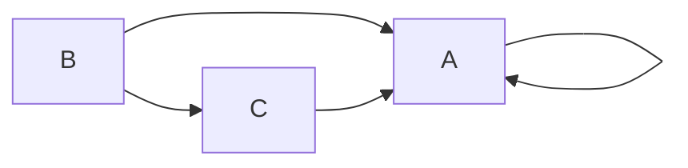

<table>
<thead><tr><th>Kumeyuri</th><th>beautiful-mermaid</th><th>mermaid-ascii</th></tr></thead>
<tbody><tr>
<td><pre><code>+---+     +---+
|   |     |   |
| B |----&gt;| C |
|   |     |   |
+---+     +---+
  |         |
  |         |
  |         |
  |         |
  |         |
+---+       |
| | |       |
|-A-|-      |
|   |       |
+---+       |
  ^         |
  +---------+
</code></pre></td>
<td><pre><code>+---+     +---+
|   |     |   |
| A |&lt;-+--| C |
|   |  |  |   |
+---+  |  +---+
  ^    |    ^  
  |    |    |  
  +----+    |  
  |         |  
  |         |  
+---+       |  
|   |       |  
| B |-------+  
|   |          
+---+          
</code></pre></td>
<td><pre><code>+---+     +---+
|   |     |   |
| A |&lt;-+--| C |
|   |  |  |   |
+---+  |  +---+
  ^    |    ^  
  |    |    |  
  +----+    |  
  |         |  
  |         |  
+---+       |  
|   |       |  
| B |-------+  
|   |          
+---+          
</code></pre></td>
</tr></tbody>
</table>

