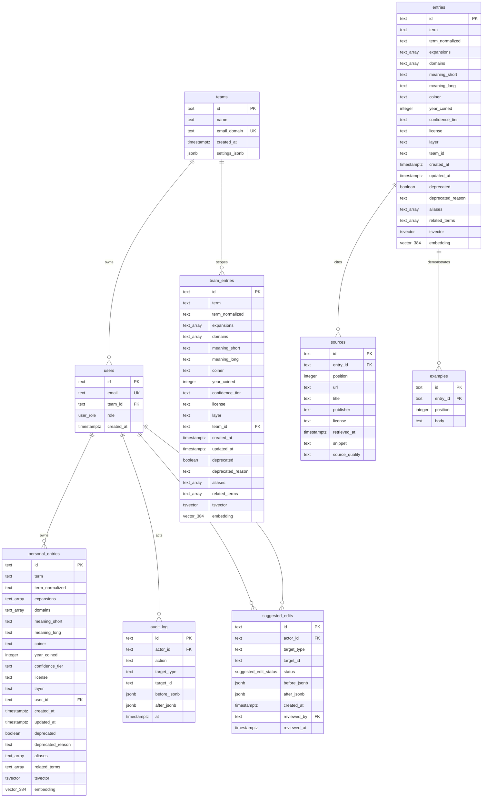

# DB Schema

Source of truth: `packages/db/src/schema.ts` and Drizzle migrations in `packages/db/drizzle/`.

## Enums

- `user_role`: `admin`, `member`
- `suggested_edit_status`: `pending`, `approved`, `rejected`

## Generated columns

- `entries.tsvector`, `team_entries.tsvector`, and `personal_entries.tsvector` are generated from term, expansions, meanings, aliases, and related terms.
- `entries.embedding`, `team_entries.embedding`, and `personal_entries.embedding` are `vector(384)` columns for semantic search.
- `sources.entry_id` cascades on entry delete.
- `examples.entry_id` cascades on entry delete.

## Constraints

- `teams.email_domain` is unique.
- `users.email` is unique.
- `team_entries.team_id` cascades on team delete.
- `personal_entries.user_id` cascades on user delete.
- Entry confidence tiers are constrained to `T1`, `T2`, `T3`, `T4`.
- Source quality is constrained to `canonical`, `secondary`, `community`.
- Overlay layers are constrained to `team` and `personal` for their respective tables.
