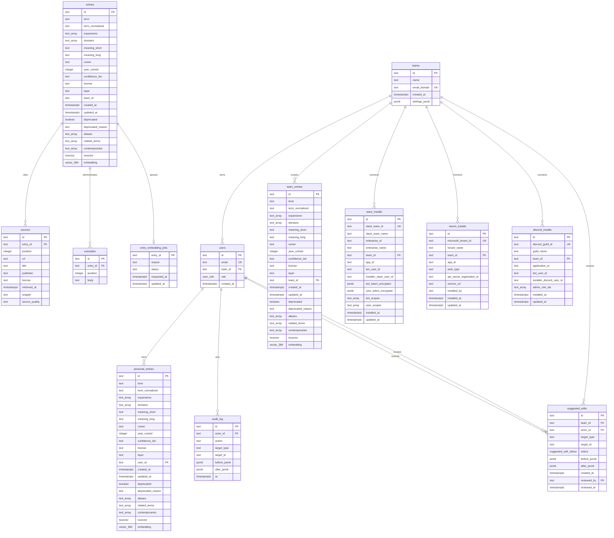

# DB Schema

Source of truth: `packages/db/src/schema.ts` and Drizzle migrations in `packages/db/drizzle/`.

## Enums

- `user_role`: `admin`, `member`
- `suggested_edit_status`: `pending`, `approved`, `rejected`

## Generated columns

- `entries.tsvector`, `team_entries.tsvector`, and `personal_entries.tsvector` are generated from term, expansions, meanings, aliases, related terms, and contemporaries.
- `entries.embedding`, `team_entries.embedding`, and `personal_entries.embedding` are `vector(384)` columns for semantic search.
- `sources.entry_id` cascades on entry delete.
- `examples.entry_id` cascades on entry delete.
- `entry_embedding_jobs.entry_id` cascades on entry delete and is maintained by `entries_embedding_enqueue_trigger`.

## Indexes

- `entries_tsvector_gin_idx`: GIN index on `entries.tsvector`.
- `entries_embedding_hnsw_idx`: HNSW index on `entries.embedding` with `vector_cosine_ops`.
- `entries_term_normalized_trgm_idx`: GIN trigram index on `entries.term_normalized`.
- `entries_term_layer_team_unique_idx`: unique partial index on active `(term_normalized, layer, team_id)` rows, with `NULLS NOT DISTINCT`.
- `slack_installs_slack_team_id_unique_idx`: unique index mapping one Slack workspace install to one wat team.
- `slack_installs_team_id_idx`: lookup index for installs by wat team.
- `teams_installs_microsoft_tenant_id_unique_idx`: unique index mapping one Microsoft tenant install to one wat team.
- `teams_installs_team_id_idx`: lookup index for Teams installs by wat team.
- `discord_installs_discord_guild_id_unique_idx`: unique index mapping one Discord guild install to one wat team.
- `discord_installs_team_id_idx`: lookup index for Discord installs by wat team.
- `suggested_edits_team_id_status_idx`: lookup index for team-scoped review queues by status.

## Constraints

- `teams.email_domain` is unique.
- `users.email` is unique.
- `team_entries.team_id` cascades on team delete.
- `slack_installs.team_id` cascades on team delete.
- `teams_installs.team_id` cascades on team delete.
- `discord_installs.team_id` cascades on team delete.
- `suggested_edits.team_id` cascades on team delete.
- `personal_entries.user_id` cascades on user delete.
- Entry confidence tiers are constrained to `T1`, `T2`, `T3`, `T4`.
- Source quality is constrained to `canonical`, `secondary`, `community`.
- Embedding job reason is constrained to `insert`, `update`; status is constrained to `pending`, `processing`, `done`, `failed`.
- Overlay layers are constrained to `team` and `personal` for their respective tables.
