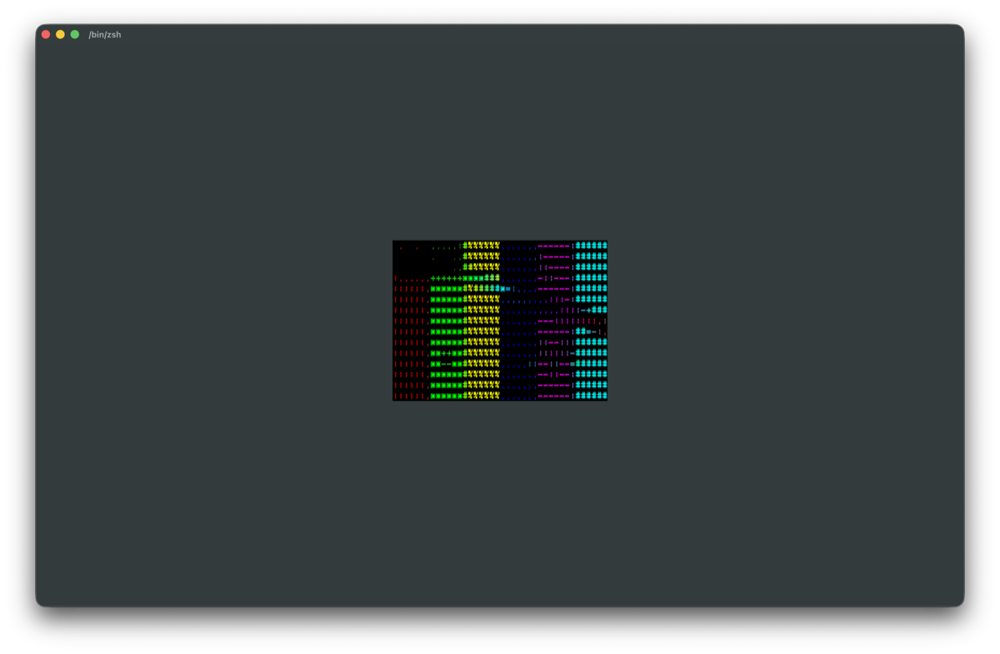
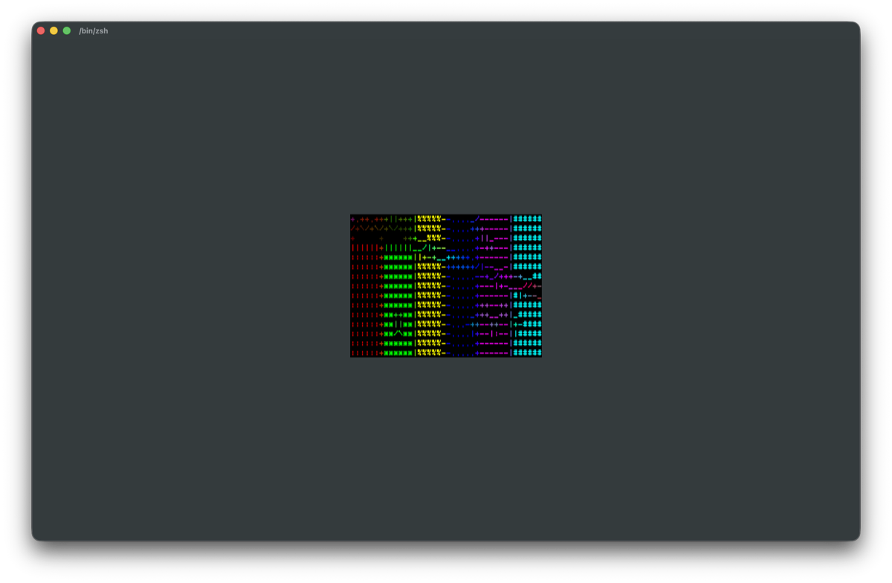

# Phase N Terminal Graphics Proof

Date: 2026-07-07
Host: macOS 26.5.1 arm64
Terminal: Ghostty 1.3.1, Kitty graphics protocol compatible per https://ghostty.org/docs/features
Protocol reference: https://sw.kovidgoyal.net/kitty/graphics-protocol/

## Source

Generated source frame:

```sh
ffmpeg -hide_banner -loglevel error -f lavfi -i testsrc2=duration=1:size=320x180:rate=1 -frames:v 1 -y /tmp/contourtty-kitty-proof-src.png
```

`--width 40 --height 15 --cell-aspect 0.6666667` maps the proof frame to 40 x 15 cells. With the in-tree 8 x 12 raster cell size, the graphics upload is 320 x 180 px.

## Pixel

Live proof:

```sh
unset NO_COLOR
export COLORTERM=truecolor TERM=xterm-ghostty
./build/ci/contourtty --render-mode pixel --caps kitty,truecolor --width 40 --height 15 --cell-aspect 0.6666667 --color-mode truecolor --log /tmp/contourtty-kitty-pixel-fullres-live.log /tmp/contourtty-kitty-proof-src.png
```

Screen capture:



Export metric:

```text
render mode pixel protocol=kitty
render stats frames=1 cells=600 render_us=67769 shape_match_cells=0
```

## Hybrid

Live proof:

```sh
unset NO_COLOR
export COLORTERM=truecolor TERM=xterm-ghostty
./build/ci/contourtty --render-mode hybrid --mode structure --edge-threshold 0.02 --dog-sigma 0 --caps kitty,truecolor --width 40 --height 15 --cell-aspect 0.6666667 --color-mode truecolor --log /tmp/contourtty-kitty-hybrid-fullres-live.log /tmp/contourtty-kitty-proof-src.png
```

Screen capture:



Export metric:

```text
render mode hybrid protocol=kitty
render stats frames=1 cells=600 render_us=109964 shape_match_cells=214
```

The hybrid export produced 236,058 bytes vs 231,218 bytes for pixel-only and 597 CSI cursor moves vs 6 for pixel-only, reflecting the structure text overlay. The `hybrid_emitter` regression test now asserts that the graphics upload starts at the same centered origin as the text overlay.

## Text Default

Verification:

```sh
ctest --test-dir build/ci -R 'hybrid_emitter|graphics_emitter|render_mode|graphics_alignment' --output-on-failure
```

Result: 6/6 passed, including `render_mode_live_smoke`, which verifies graphics degradation back to text when no graphics caps are available.
