# kumeyuri example gallery

Run `scripts/render-examples.sh` from the repository root to regenerate the
rendered assets.

| Preview | Example | Type | Source | Rendered |
| --- | --- | --- | --- | --- |
|  | CI pipeline | Flowchart | [ci-pipeline.mmd](./ci-pipeline.mmd) | [SVG](./rendered/ci-pipeline.svg) / [GIF](./rendered/ci-pipeline.gif) |
|  | Data ingest | Flowchart | [data-ingest.mmd](./data-ingest.mmd) | [SVG](./rendered/data-ingest.svg) / [GIF](./rendered/data-ingest.gif) |
|  | Feature rollout | Flowchart | [feature-rollout.mmd](./feature-rollout.mmd) | [SVG](./rendered/feature-rollout.svg) / [GIF](./rendered/feature-rollout.gif) |
|  | Incident response | Flowchart | [incident-response.mmd](./incident-response.mmd) | [SVG](./rendered/incident-response.svg) / [GIF](./rendered/incident-response.gif) |
|  | Cache refresh | Flowchart | [cache-refresh.mmd](./cache-refresh.mmd) | [SVG](./rendered/cache-refresh.svg) / [GIF](./rendered/cache-refresh.gif) |
|  | Checkout validation | Flowchart | [checkout-validation.mmd](./checkout-validation.mmd) | [SVG](./rendered/checkout-validation.svg) / [GIF](./rendered/checkout-validation.gif) |
|  | OAuth login | Sequence | [oauth-login.mmd](./oauth-login.mmd) | [SVG](./rendered/oauth-login.svg) / [GIF](./rendered/oauth-login.gif) |
|  | Payment retry | Sequence | [payment-retry.mmd](./payment-retry.mmd) | [SVG](./rendered/payment-retry.svg) / [GIF](./rendered/payment-retry.gif) |
|  | Support handoff | Sequence | [support-handoff.mmd](./support-handoff.mmd) | [SVG](./rendered/support-handoff.svg) / [GIF](./rendered/support-handoff.gif) |
|  | WebSocket session | Sequence | [websocket-session.mmd](./websocket-session.mmd) | [SVG](./rendered/websocket-session.svg) / [GIF](./rendered/websocket-session.gif) |
|  | Cache-aside read | Sequence | [cache-aside-read.mmd](./cache-aside-read.mmd) | [SVG](./rendered/cache-aside-read.svg) / [GIF](./rendered/cache-aside-read.gif) |
|  | Job worker state | State | [job-worker-state.mmd](./job-worker-state.mmd) | [SVG](./rendered/job-worker-state.svg) / [GIF](./rendered/job-worker-state.gif) |
|  | Order lifecycle | State | [order-lifecycle.mmd](./order-lifecycle.mmd) | [SVG](./rendered/order-lifecycle.svg) / [GIF](./rendered/order-lifecycle.gif) |
|  | Circuit breaker | State | [circuit-breaker.mmd](./circuit-breaker.mmd) | [SVG](./rendered/circuit-breaker.svg) / [GIF](./rendered/circuit-breaker.gif) |
|  | Document review | State | [document-review.mmd](./document-review.mmd) | [SVG](./rendered/document-review.svg) / [GIF](./rendered/document-review.gif) |
